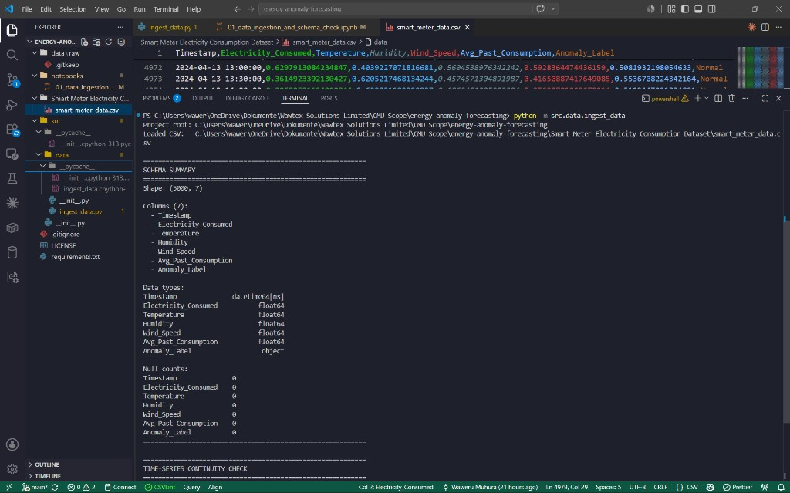
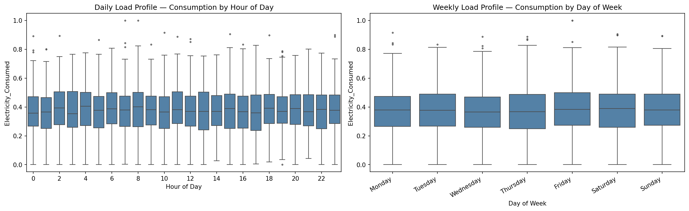

# Energy Anomaly Forecasting

[](LICENSE)
[](https://www.python.org/downloads/)
[](#verified-results)

Open-source machine learning project for **energy consumption anomaly detection** and **time-series forecasting**, built entirely on the public [Kaggle Smart Meter Electricity Consumption Dataset](https://www.kaggle.com/datasets/ziya07/smart-meter-electricity-consumption-dataset).

**Executive summary:** This project turns smart-meter data into a reliable timeline for analysis and forecasting. Phases 1–2 are complete (detect + clean). Phase 3 adds a forecasting ladder: naive floor (MAE ≈ **0.171**, RMSE ≈ **0.214**), Prophet (≈ **0.121** / **0.149**), XGBoost (≈ **0.125** / **0.154**), and LSTM (≈ **0.122** / **0.151**) on native test windows. Unified comparison: `python scripts/compare_forecasts.py`. Root E2E CLI: `python main.py --model naive` (ingest → detect → clean → split → forecast → metrics → `final_predictions.csv`; `--output_path` / `--save_clean_data` optional). Tutorial: [`notebooks/04_forecasting_tutorial.ipynb`](notebooks/04_forecasting_tutorial.ipynb). Research: [Forecasting Research](docs/forecasting-research.md) (Prophet leads default ladder). **Production cleaning is unchanged** (~248 corrected intervals via `generate_clean_data.py`). Full docs: [docs site](docs/index.md) · [E2E Pipeline](docs/e2e-pipeline.md) · [Forecasting Tutorial](docs/forecasting-tutorial.md) · [Forecasting Research](docs/forecasting-research.md) · [Forecast Model Comparison](docs/forecast-model-comparison.md) · [Glossary](docs/glossary.md).

---

## Overview

This repository implements a phased ML pipeline:

| Phase | Scope | Status |
|-------|-------|--------|
| **Phase 1 Week 1** | Environment setup, data ingestion, schema validation | **Complete** |
| **Phase 1 Week 2** | Exploratory data analysis and load profiling | **Complete** |
| **Phase 2 Week 3** | Feature engineering (temporal + rolling metrics) | **Complete** |
| **Phase 2 Week 4** | Anomaly detection (IF + DBSCAN baselines) | **Complete** |
| **Phase 3 Week 6 Day 1–2** | Forecasting foundation (gate, split, metrics, naive baseline) | **Complete** |
| **Phase 3 Week 6 Day 3** | Prophet statistical baseline | **Complete** |
| **Phase 3 Week 7 Day 1** | XGBoost supervised lag prep | **Complete** |
| **Phase 3 Week 7 Day 2** | XGBoost regressor training and evaluation | **Complete** |
| **Phase 3 Week 7 Day 3** | LSTM sequence prep | **Complete** |
| **Phase 3 Week 7 Days 4–5** | LSTM architecture, training, inference | **Complete** |
| **Phase 3 Week 8 Day 1** | Unified forecast model comparison | **Complete** |
| **Phase 3 Week 8 Day 2** | E2E pipeline scaffold (`main.py`) | **Complete** |
| **Phase 3 Week 8 Day 3** | E2E detect + interpolate + `--save_clean_data` | **Complete** |
| **Phase 3 Week 8 Day 4** | E2E split + CLI model routing | **Complete** |
| **Phase 3 Week 8 Day 5** | E2E metrics + prediction CSV export | **Complete** |
| **Phase 3 Week 9 Days 1–2** | Forecasting tutorial notebook | **Complete** |
| **Phase 3 Week 9 Days 3–4** | Forecasting research write-up | **Complete** |

All work uses publicly available data. No proprietary datasets or systems are referenced.

---

## Quick Start

```bash
git clone https://github.com/mj-weshh/energy-anomaly-forecasting.git
cd energy-anomaly-forecasting

python -m venv .venv
.venv\Scripts\activate        # Windows
# source .venv/bin/activate   # macOS / Linux

pip install -r requirements.txt
python -m src.data.ingest_data
```

Expected output: schema summary with shape `(5000, 7)`, zero nulls, and continuity check **PASS**.

---

## Verified Results

Phase 1, Week 1 acceptance criteria — verified locally on `smart_meter_data.csv`:

| Check | Result |
|-------|--------|
| Shape | `(5000, 7)` |
| Null values | 0 across all columns |
| `Timestamp` dtype | `datetime64[ns]` |
| Sampling frequency | 30 minutes |
| Date range | `2024-01-01` → `2024-04-14` |
| Continuity | **PASS** — no gaps, duplicates, or irregular intervals |



Full evidence: [Verification Report](docs/verification-report.md)

---

## EDA Results (Phase 1, Week 2)

Key findings from exploratory analysis on the same dataset:

| Finding | Result |
|---------|--------|
| Peak mean consumption hour | **02:00** |
| Weather correlation with consumption | Negligible (|r| &lt; 0.01) |
| Strongest linear predictor | `Avg_Past_Consumption` (r = +0.317) |
| Anomaly label baseline | **5% Abnormal** (250 / 5,000) |



Full report with all figures: [EDA Insights](docs/eda-insights.md)

Regenerate doc figures: `python scripts/export_eda_assets.py` (EDA) · `python scripts/generate_mermaid_assets.py` (architecture PNGs)

---

## Project Structure

```
energy-anomaly-forecasting/
├── main.py                         # E2E CLI entry point (Week 8 Day 2+)
├── data/
│   ├── raw/                        # Canonical raw data location (optional)
│   └── processed/                  # Generated clean CSV (gitignored)
├── docs/                           # Documentation (MkDocs source)
│   └── assets/                     # Verification screenshots and EDA figures
│       ├── eda/                    # Exported Phase 1 Week 2 plots (PNG)
│       └── forecast_comparison.png # Phase 3 Week 8 model comparison plot
├── notebooks/
│   ├── 01_data_ingestion_and_schema_check.ipynb
│   ├── 02_exploratory_data_analysis.ipynb
│   └── 03_anomaly_detection.ipynb
├── scripts/
│   ├── export_eda_assets.py        # Regenerate EDA doc figures
│   ├── generate_mermaid_assets.py  # Regenerate architecture PNGs (mermaid.ink)
│   ├── verify_features.py          # Sanity-check engineered features
│   ├── test_isolation_forest.py    # Isolation Forest baseline + evaluation
│   ├── tune_isolation_forest.py    # Enhanced IF hyperparameter + threshold tuning
│   ├── tune_dbscan.py              # DBSCAN hyperparameter grid search
│   ├── tune_ensemble.py            # IF + DBSCAN ensemble comparison
│   ├── compare_anomaly_models.py   # Legacy vs enhanced research dashboard
│   ├── analyze_detection_errors.py # Legacy IF hourly FP analysis
│   ├── compare_clean_artifacts.py  # Diff legacy vs research clean CSVs
│   ├── tune_isolation_forest_by_segment.py  # Per-hour/weekend test F1
│   ├── generate_clean_data.py      # Generate Phase 3 clean dataset artifact
│   ├── verify_phase2_state.py      # Phase 3 gate: clean CSV continuity / NaNs
│   ├── evaluate_naive_baseline.py  # Score naive seasonal forecast on test set
│   ├── evaluate_prophet.py         # Score Prophet statistical baseline on test set
│   ├── verify_xgboost_prep.py      # Verify supervised lag tabular frame
│   ├── evaluate_xgboost.py         # Train and score XGBoost regressor on test set
│   ├── verify_lstm_prep.py         # Verify 3D LSTM sequence tensors
│   └── compare_forecasts.py        # Run all four models; metrics table + PNG
├── src/
│   ├── data/
│   │   ├── ingest_data.py          # Canonical ingestion module
│   │   ├── clean_data.py           # Anomaly masking and interpolation
│   │   └── make_forecast_dataset.py # Chronological train/val/test split
│   ├── features/
│   │   └── build_features.py       # Temporal, rolling, supervised lags, and LSTM sequences
│   ├── models/
│   │   ├── evaluate_models.py      # Imbalance-aware anomaly evaluation
│   │   ├── evaluate_forecast.py    # Forecast MAE / RMSE / MAPE
│   │   ├── train_anomaly_models.py # Unsupervised anomaly training
│   │   ├── train_forecast_models.py # Naive, Prophet, XGBoost, and LSTM forecast trainers
│   │   ├── lstm_model.py           # EnergyLSTM architecture (PyTorch)
│   │   ├── anomaly_preprocessing.py # Train-fitted scaling for tuning
│   │   ├── tuning_utils.py         # Temporal splits and threshold search
│   │   └── anomaly_config.py       # Research-tuned hyperparameters
│   └── visualization/
│       └── visualize.py            # EDA plotting functions
├── Smart Meter Electricity Consumption Dataset/
│   └── smart_meter_data.csv
├── requirements.txt
├── mkdocs.yml
└── README.md
```

---

## Dataset

**Source:** [Kaggle — Smart Meter Electricity Consumption Dataset](https://www.kaggle.com/datasets/ziya07/smart-meter-electricity-consumption-dataset) by [ziya07](https://www.kaggle.com/ziya07)

| Property | Value |
|----------|-------|
| Filename | `smart_meter_data.csv` |
| Rows | 5,000 |
| Interval | 30 minutes |
| Columns | 7 (timestamp, 5 features, 1 label) |

Place the CSV in `data/raw/` or keep it in `Smart Meter Electricity Consumption Dataset/`. The ingestion script discovers it automatically.

Schema reference: [Data Schema](docs/data-schema.md)

---

## Documentation

| Document | Description |
|----------|-------------|
| [Getting Started](docs/getting-started.md) | Local, Colab, and Kaggle setup |
| [Data Schema](docs/data-schema.md) | Formal data dictionary |
| [Verification Report](docs/verification-report.md) | Phase 1 Week 1 QA evidence |
| [EDA Insights](docs/eda-insights.md) | Phase 1 Week 2 findings with figures |
| [Architecture](docs/architecture.md) | Repository layout and data flow |
| [Phase 2 Strategy](docs/phase2-strategy.md) | Anomaly detection planning grounded in Phase 1 EDA |
| [Feature Engineering](docs/feature-engineering.md) | Phase 2 Week 3 temporal features and rolling metrics |
| [Anomaly Detection](docs/anomaly-detection.md) | Phase 2 Week 4 IF + DBSCAN baselines, grid search, model comparison, and educational notebook |
| [Anomaly Tuning Results](docs/anomaly-tuning-results.md) | Phase 2 research tuning report — enhanced features, temporal splits, fair comparison |
| [Clean Dataset](docs/clean-data.md) | Phase 2 Week 4 Day 3 anomaly masking, interpolation, and Phase 3 artifact |
| [Forecasting Baseline](docs/forecasting-baseline.md) | Phase 3 Week 6 Day 1–2 gate, chronological split, metrics, naive floor |
| [Prophet Baseline](docs/prophet-baseline.md) | Phase 3 Week 6 Day 3 Prophet trainer and evaluation |
| [XGBoost Prep](docs/xgboost-prep.md) | Phase 3 Week 7 Day 1 supervised lag features |
| [XGBoost Forecasting](docs/xgboost-forecasting.md) | Phase 3 Week 7 Day 2 XGBoost trainer and scoring |
| [LSTM Prep](docs/lstm-prep.md) | Phase 3 Week 7 Day 3 sliding-window sequence tensors |
| [LSTM Forecasting](docs/lstm-forecasting.md) | Phase 3 Week 7 Days 4–5 LSTM training and inference |
| [Forecast Model Comparison](docs/forecast-model-comparison.md) | Phase 3 Week 8 unified ladder scoring and visualization |
| [E2E Pipeline](docs/e2e-pipeline.md) | Phase 3 Week 8 Days 2–5 root `main.py` CLI (ingest → forecast → metrics → CSV) |
| [Forecasting Tutorial](docs/forecasting-tutorial.md) | Phase 3 Week 9 CMU educational notebook (XGBoost path) |
| [Forecasting Research](docs/forecasting-research.md) | Phase 3 Week 9 research write-up — ladder winner and weather vs history |
| [Phase 3 Strategy](docs/phase3-strategy.md) | Forecasting planning — model ladder and evaluation protocol |
| [Glossary](docs/glossary.md) | Shared plain-English and technical term definitions |

### Build docs site locally

```bash
pip install mkdocs mkdocs-material
mkdocs serve    # http://127.0.0.1:8000
mkdocs build    # output to site/
```

---

## Usage

### CLI

Root E2E entry (Days 2–5: ingest → detect → clean → split → `--model` forecast → metrics → CSV):

```bash
python main.py --model naive
python main.py --model xgboost
python main.py --save_clean_data
python main.py --output_path data/processed/final_predictions.csv
python main.py --help
```

Focused scripts:

```bash
python -m src.data.ingest_data
python scripts/export_eda_assets.py
python scripts/generate_mermaid_assets.py
python scripts/verify_features.py
python scripts/test_isolation_forest.py
python scripts/tune_dbscan.py
python scripts/tune_isolation_forest.py
python scripts/tune_ensemble.py
python scripts/compare_anomaly_models.py
python scripts/analyze_detection_errors.py
python scripts/tune_isolation_forest_by_segment.py
python scripts/generate_clean_data.py
python scripts/generate_clean_data.py --profile legacy_threshold
python scripts/generate_clean_data.py --profile enhanced
python scripts/compare_clean_artifacts.py
python scripts/verify_phase2_state.py
python -m src.data.make_forecast_dataset
python scripts/evaluate_naive_baseline.py
python scripts/evaluate_prophet.py
python scripts/verify_xgboost_prep.py
python scripts/evaluate_xgboost.py
python scripts/verify_lstm_prep.py
python scripts/compare_forecasts.py
```

### Python API

```python
from src.data.ingest_data import find_dataset_csv, load_smart_meter_data, get_project_root

csv_path = find_dataset_csv(get_project_root())
df = load_smart_meter_data(csv_path)
print(df.shape)  # (5000, 7)
```

### Feature Engineering (Phase 2)

```python
from src.features.build_features import add_temporal_features, add_rolling_metrics, build_all_features

df = build_all_features(df)  # or: add_rolling_metrics(add_temporal_features(df))
print(df.shape)  # (5000, 15) — adds hour, day_of_week, month, is_weekend,
                 # and 3h/24h rolling mean + std over Electricity_Consumed
```

### Anomaly Detection (Phase 2)

```python
from src.features.build_features import build_all_features
from src.models.train_anomaly_models import detect_anomalies, train_dbscan, train_isolation_forest

df_feat = build_all_features(df)

# Unified router
model, predictions = detect_anomalies(df_feat, model_type="isolation_forest")
model, predictions = detect_anomalies(df_feat, model_type="dbscan", eps=0.5, min_samples=5)
```

### Clean Dataset (Phase 2 → Phase 3)

```python
from src.data.clean_data import generate_clean_dataset
from src.data.ingest_data import find_dataset_csv, get_project_root

generate_clean_dataset(
    str(find_dataset_csv(get_project_root())),
    "data/processed/clean_smart_meter_data.csv",
)
```

### Forecasting Baseline (Phase 3 Day 1–2)

```python
import pandas as pd
from src.data.make_forecast_dataset import time_series_split
from src.models.train_forecast_models import naive_seasonal_forecast
from src.models.evaluate_forecast import evaluate_forecast

df = pd.read_csv("data/processed/clean_smart_meter_data.csv", parse_dates=["Timestamp"])
train, val, test = time_series_split(df)
y_pred = naive_seasonal_forecast(
    train["Electricity_Consumed"].to_numpy(),
    test["Electricity_Consumed"].to_numpy(),
    seasonal_periods=48,
)
print(evaluate_forecast(test["Electricity_Consumed"].to_numpy(), y_pred))
```

Full notes: [Forecasting Baseline](docs/forecasting-baseline.md).

### XGBoost Forecasting (Phase 3 Week 7)

```python
import pandas as pd
from src.data.make_forecast_dataset import time_series_split
from src.features.build_features import create_supervised_lags
from src.models.train_forecast_models import train_xgboost_model
from src.models.evaluate_forecast import evaluate_forecast

FEATURE_COLUMNS = [
    "Electricity_Consumed_lag_1",
    "Electricity_Consumed_lag_2",
    "Electricity_Consumed_lag_48",
    "Temperature",
    "Humidity",
    "hour",
    "day_of_week",
    "month",
    "is_weekend",
]

df = pd.read_csv("data/processed/clean_smart_meter_data.csv", parse_dates=["Timestamp"])
tabular = create_supervised_lags(df)
train, val, test = time_series_split(tabular)
model = train_xgboost_model(
    train[FEATURE_COLUMNS], train["Electricity_Consumed"],
    val[FEATURE_COLUMNS], val["Electricity_Consumed"],
)
y_pred = model.predict(test[FEATURE_COLUMNS])
print(evaluate_forecast(test["Electricity_Consumed"].to_numpy(), y_pred))
```

Full notes: [XGBoost Prep](docs/xgboost-prep.md) · [XGBoost Forecasting](docs/xgboost-forecasting.md) · [Prophet Baseline](docs/prophet-baseline.md).

### LSTM Forecasting (Phase 3 Week 7)

```python
import numpy as np
import pandas as pd
import torch
from src.features.build_features import create_sequences
from src.models.lstm_model import EnergyLSTM
from src.models.train_forecast_models import (
    make_lstm_dataloader,
    train_lstm_model,
    predict_lstm,
)
from src.models.evaluate_forecast import evaluate_forecast

FEATURE_COLUMNS = [
    "Electricity_Consumed", "Temperature", "Humidity",
    "hour", "day_of_week", "month", "is_weekend",
]

df = pd.read_csv("data/processed/clean_smart_meter_data.csv", parse_dates=["Timestamp"])
matrix = df[FEATURE_COLUMNS].to_numpy(dtype=np.float32)
X, y = create_sequences(matrix, seq_length=24)
n = len(X)
train_end, val_end = int(n * 0.7), int(n * 0.85)
X_train, y_train = X[:train_end], y[:train_end]
X_val, y_val = X[train_end:val_end], y[train_end:val_end]
X_test, y_test = X[val_end:], y[val_end:]

train_loader = make_lstm_dataloader(X_train, y_train)
val_loader = make_lstm_dataloader(X_val, y_val)
test_loader = make_lstm_dataloader(X_test, y_test)

model = EnergyLSTM(input_size=7, hidden_size=64)
train_lstm_model(model, train_loader, val_loader, epochs=20)
y_pred = predict_lstm(model, test_loader)
print(evaluate_forecast(y_test[:, 0], y_pred))
```

Full notes: [LSTM Prep](docs/lstm-prep.md) · [LSTM Forecasting](docs/lstm-forecasting.md) · [Forecast Model Comparison](docs/forecast-model-comparison.md).

### Phase 2 research results (held-out test)

Production cleaning still uses legacy IF (full-dataset F1 **0.331**). Research tuning on the same 991-row test window (`scripts/compare_anomaly_models.py`):

| Model | Test F1 |
|-------|---------|
| Legacy IF (production params) | 0.340 |
| Legacy IF (val threshold) | 0.389 |
| Enhanced IF (tuned) | **0.460** |

Full methodology: [Anomaly Tuning Results](docs/anomaly-tuning-results.md) · metrics in `src/models/anomaly_config.py`.

### Notebooks

- [`notebooks/01_data_ingestion_and_schema_check.ipynb`](notebooks/01_data_ingestion_and_schema_check.ipynb) — ingestion and schema validation
- [`notebooks/02_exploratory_data_analysis.ipynb`](notebooks/02_exploratory_data_analysis.ipynb) — Phase 1 Week 2 EDA
- [`notebooks/03_anomaly_detection.ipynb`](notebooks/03_anomaly_detection.ipynb) — Phase 2 Week 4 CMU tutorial: unsupervised detection, benchmark evaluation, and consumption interpolation
- [`notebooks/04_forecasting_tutorial.ipynb`](notebooks/04_forecasting_tutorial.ipynb) — Phase 3 Week 9 CMU tutorial: chronological split, lags, XGBoost, metrics, Actual vs Predicted ([docs](docs/forecasting-tutorial.md))

---

## License

This project is licensed under the [MIT License](LICENSE).

Copyright (c) 2026 Waweru Muhura
