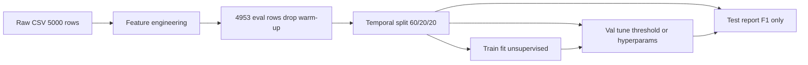

# Anomaly Tuning Results — Phase 2 Research

Full report from the enhanced-feature and temporal-split tuning experiments. Production cleaning is **unchanged** — this page documents research-only scripts under `scripts/tune_*.py`.

**Run date:** 2026-07-14  
**Dataset:** 4,953 evaluation rows (5,000 minus 47 rolling warm-up NaNs)  
**Modules:** `src/models/anomaly_config.py`, `src/models/tuning_utils.py`, `src/models/anomaly_preprocessing.py`

---

## Executive Summary

| Approach | Test F1 | Verdict |
|----------|---------|---------|
| **Legacy IF** (full dataset, production) | **0.331** | Production baseline — unchanged |
| **Legacy IF** (temporal test, production params) | **0.340** | Fair baseline on held-out window |
| **Legacy IF** (temporal test, val threshold only) | **0.389** | Same split protocol as enhanced, no hyperparam grid |
| **Enhanced IF** (temporal test, tuned) | **0.460** | **Best single model** (+0.071 F1, ~18% relative vs val-threshold legacy 0.389) |
| **Enhanced DBSCAN** (temporal test) | **0.297** | Improved vs legacy DBSCAN (0.125), still below IF |
| **Ensemble union** (temporal test) | **0.400** | Modest gain; below enhanced IF alone |
| **Ensemble intersection** (temporal test) | **0.329** | Flat vs legacy full-dataset F1 |

**Bottom line:** Enhanced Isolation Forest with 21 features, train-only scaling, and validation-tuned score threshold **meaningfully improves** anomaly detection on unseen time periods. DBSCAN and ensemble strategies did not beat the best IF config. The production clean-data pipeline still uses legacy 15-column features and default IF.

### How to compare uplift

Use **percentage points** or **+0.071 F1** for absolute deltas; reserve **% relative** for ratio uplift. Source: `src/models/anomaly_config.py` (`TUNING_METRICS`).

| Comparison | Absolute gain | Relative gain |
|------------|---------------|---------------|
| Enhanced (0.460) vs legacy test production (0.340) | +0.120 F1 | +35% |
| Enhanced (0.460) vs legacy test val-threshold (0.389) | +0.071 F1 | ~18% |

---

## Methodology

Research tuning follows a strict temporal evaluation protocol so metrics are not inflated by training on the same rows used for scoring.



| Rule | Detail |
|------|--------|
| **Split** | Chronological 60/20/20 via `temporal_train_val_test_split` — train 2,971 / val 991 / test 991 rows |
| **Labels** | `Anomaly_Label` is benchmark-only; never used during model fit |
| **Scaling** | Enhanced path: `AnomalyPreprocessor` fit on **train rows only** (StandardScaler + hourly z-score on consumption) |
| **Threshold** | Enhanced IF: hyperparameter grid on validation F1; score threshold chosen on validation |
| **Metric** | Precision, recall, F1 with **Abnormal = positive class** (no accuracy) |

---

## Feature Sets

| Pipeline | Function | Columns | Used by |
|----------|----------|---------|---------|
| **Legacy (production)** | `build_all_features` | 15 | `generate_clean_data.py`, notebook, Day 1–4 baselines |
| **Enhanced (research)** | `build_enhanced_anomaly_features` | 21 | `scripts/tune_*.py` |

Enhanced adds cyclical time encoding (`hour_sin/cos`, `dow_sin/cos`) and consumption derivatives (`consumption_diff`, `consumption_residual_24h`). See [Feature Engineering — Enhanced Anomaly Features](feature-engineering.md#enhanced-anomaly-features-research).

---

## Search Spaces

### Isolation Forest (`scripts/tune_isolation_forest.py`)

| Parameter | Values searched |
|-----------|-----------------|
| `contamination` | 0.03, 0.04, 0.05, 0.06, 0.07, 0.08 |
| `n_estimators` | 100, 200, 300 |
| `max_features` | 1.0, 0.8, 0.6 |
| Decision mode | Score threshold (val F1) vs raw contamination predict |

### DBSCAN (`scripts/tune_dbscan.py`)

| Mode | Grid |
|------|------|
| **Legacy** (`--legacy`) | `eps` ∈ {0.1, 0.3, 0.5, 0.7} × `min_samples` ∈ {5, 10, 20}, unscaled, full dataset |
| **Enhanced** | `eps` 0.5–10.0 × `min_samples` {3,5,10,15,20} × metric {euclidean, manhattan}, scaled, validation F1 |

### Ensemble (`scripts/tune_ensemble.py`)

Strategies: `intersection`, `union`, `weighted` (alpha 0.5–0.9). Uses fixed best IF and DBSCAN configs from tuning runs.

---

## Best Configurations

Stored in `src/models/anomaly_config.py`:

### Enhanced Isolation Forest

| Parameter | Value |
|-----------|-------|
| `contamination` | 0.03 |
| `n_estimators` | 200 |
| `max_features` | 0.6 |
| `scale` | True |
| `score_threshold` | 0.016764 |
| `drop_weather` | False |

### Enhanced DBSCAN

| Parameter | Value |
|-----------|-------|
| `eps` | 10.0 |
| `min_samples` | 10 |
| `metric` | manhattan |
| `scale` | True |

### Best Ensemble

| Parameter | Value |
|-----------|-------|
| `strategy` | union |
| `alpha` | 0.7 |

---

## Results — Legacy Baselines (Full Dataset)

From `python scripts/test_isolation_forest.py` and `python scripts/tune_dbscan.py --legacy`:

### Legacy Isolation Forest (production params)

| Metric | Value |
|--------|-------|
| Precision | 0.331 |
| Recall | 0.331 |
| F1 | **0.331** |

Confusion matrix [[TN, FP], [FN, TP]]:

```
  TN=4539  FP= 166
  FN= 166  TP=  82
```

Params: `contamination=0.05`, `n_estimators=100`, `max_features=1.0`, unscaled, all 4,953 rows for train + predict.

### Legacy DBSCAN

| Metric | Value |
|--------|-------|
| Best config | `eps=0.5`, `min_samples=5` |
| F1 | **0.125** |

Confusion matrix: TN=4040, FP=665, FN=187, TP=61 (726 predicted anomalies).

---

## Results — Enhanced Tuning (Temporal Splits)

From `python scripts/tune_isolation_forest.py` (2026-07-14 run):

### Enhanced Isolation Forest

| Split | Precision | Recall | F1 |
|-------|-----------|--------|-----|
| Train | 0.793 | 0.170 | 0.280 |
| Val | 0.660 | 0.569 | 0.611 |
| **Test** | **0.625** | **0.364** | **0.460** |

Test confusion matrix:

```
  TN= 924  FP=  12
  FN=  35  TP=  20
```

### Enhanced DBSCAN

| Split | Precision | Recall | F1 |
|-------|-----------|--------|-----|
| Train | 0.400 | 0.326 | 0.359 |
| Val | 0.538 | 0.483 | 0.509 |
| **Test** | **0.326** | **0.273** | **0.297** |

### Ensemble Strategies (test F1)

| Strategy | Val F1 | Test F1 |
|----------|--------|---------|
| intersection | 0.552 | 0.329 |
| **union** | **0.565** | **0.400** |
| weighted α=0.7 | 0.547 | 0.389 |
| weighted α=0.8 | 0.475 | 0.444 |

---

## Fair Head-to-Head — Legacy vs Enhanced IF (Same Test Split)

Earlier comparisons mixed **legacy full-dataset F1 (0.331)** with **enhanced test F1 (0.460)**. The table below evaluates all models on the **same chronological test window** (991 rows, last 20% of eval data).

From `python scripts/compare_anomaly_models.py`:

| Model | Precision | Recall | F1 | Notes |
|-------|-----------|--------|-----|-------|
| Legacy IF (full data) | 0.331 | 0.331 | 0.331 | Production-style; not test-split |
| **Legacy IF (test)** | 0.214 | 0.818 | **0.340** | Train 60% only; production params |
| **Legacy IF (test, val threshold)** | 0.379 | 0.400 | **0.389** | Same protocol as enhanced; no hyperparam grid |
| **Enhanced IF (test)** | 0.625 | 0.364 | **0.460** | Tuned features + scaling + grid + threshold |

### Test-split confusion matrices

**Legacy IF (production params on test):**

```
  TN= 771  FP= 165
  FN=  10  TP=  45
```

High recall (0.818) but low precision (0.214) — flags many normal readings as abnormal on the held-out window.

**Legacy IF (validation threshold on test):**

```
  TN= 900  FP=  36
  FN=  33  TP=  22
```

Threshold tuning alone lifts F1 from 0.340 → 0.389 without changing features or hyperparameters.

**Enhanced IF (test):**

```
  TN= 924  FP=  12
  FN=  35  TP=  20
```

Enhanced IF still wins on F1 (+0.071 F1, ~18% relative vs protocol-matched legacy 0.389; +0.120 F1, +35% relative vs production-params legacy on test 0.340). Trade-off: higher precision (0.625 vs 0.379) at lower recall (0.364 vs 0.400) than threshold-only legacy.

---

## Production vs Research

| Aspect | Production (`generate_clean_data.py`) | Research (`scripts/tune_*.py`) |
|--------|-------------------------------------|--------------------------------|
| Features | 15 columns (`build_all_features`) | 21 columns (`build_enhanced_anomaly_features`) |
| IF params | `contamination=0.05`, defaults | Tuned: `contamination=0.03`, `n_estimators=200`, etc. |
| Scaling | None | Train-only StandardScaler + hourly z-score |
| Evaluation | Full 4,953 rows | Temporal train/val/test |
| Config source | Hard-coded in trainer | `src/models/anomaly_config.py` |

Adopting tuned IF for production cleaning is optional and was explicitly deferred to keep the Phase 3 artifact stable.

---

## How to Reproduce

```bash
pip install -r requirements.txt

# Baselines
python scripts/test_isolation_forest.py
python scripts/tune_dbscan.py --legacy

# Research tuning
python scripts/tune_isolation_forest.py
python scripts/tune_dbscan.py
python scripts/tune_ensemble.py
python scripts/compare_anomaly_models.py
```

Expected headline numbers (test split where applicable):

- Legacy IF full dataset F1 ≈ **0.331**
- Legacy IF test F1 ≈ **0.340** (production params) / **0.389** (val threshold)
- Enhanced IF test F1 ≈ **0.460**
- Enhanced DBSCAN test F1 ≈ **0.297**
- Ensemble union test F1 ≈ **0.400**

Configs and metrics are also recorded in `src/models/anomaly_config.py`.

---

## Conclusions

1. **Enhanced IF is the clear research winner** — test F1 **0.460** vs **0.389** (best fair legacy) and **0.340** (production legacy on test).
2. **Legacy full-dataset F1 understates held-out performance slightly** — legacy test F1 is 0.340, not 0.331, but still well below enhanced.
3. **DBSCAN improved with scaling and wider eps** (0.125 → 0.297 test) but remains weaker than IF for this benchmark.
4. **Ensemble union (0.400)** beats fair legacy IF but not enhanced IF alone; intersection (0.329) adds precision at the cost of recall.
5. **Production pipeline unchanged** — clean dataset generation still reports F1 ≈ 0.331 for the legacy baseline.

---

## References

- [Anomaly Detection](anomaly-detection.md) — Week 4 baselines and API
- [Feature Engineering](feature-engineering.md) — legacy vs enhanced features
- [Phase 2 Strategy](phase2-strategy.md) — design rationale
- [Clean Dataset](clean-data.md) — production imputation pipeline
