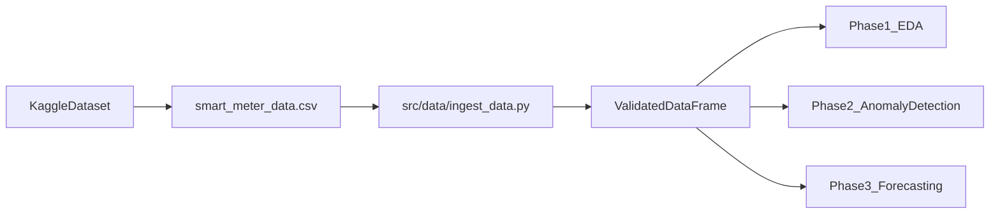
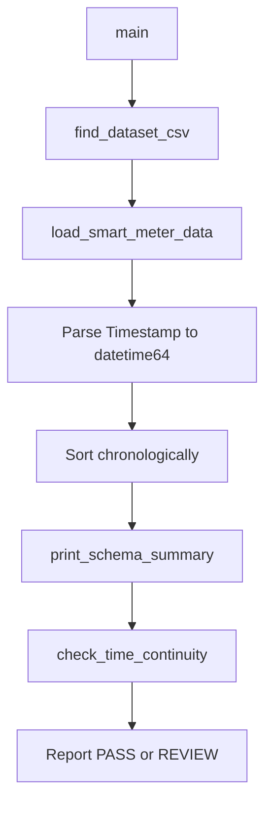

# Architecture

Repository layout, data flow, and design decisions for Phase 1.

---

## System Overview



The ingestion layer is the **single gate** between raw CSV files and all downstream work. Every notebook and script in later phases should import from `src.data.ingest_data` rather than reading CSVs directly.

---

## Repository Layout

```
energy-anomaly-forecasting/
├── data/
│   └── raw/                          # Canonical location for raw CSV (optional)
├── docs/                             # Project documentation (MkDocs source)
│   └── assets/                       # Screenshots and static assets
├── notebooks/
│   └── 01_data_ingestion_and_schema_check.ipynb
├── src/
│   ├── __init__.py
│   └── data/
│       ├── __init__.py
│       └── ingest_data.py            # Canonical ingestion module
├── Smart Meter Electricity Consumption Dataset/
│   └── smart_meter_data.csv          # Current raw data location
├── .gitignore
├── LICENSE
├── mkdocs.yml
├── README.md
└── requirements.txt
```

### Directory rationale

| Path | Purpose |
|------|---------|
| `src/` | Reusable, importable Python modules |
| `notebooks/` | Interactive workflows for exploration and reporting |
| `data/raw/` | Future canonical storage for raw files |
| `docs/` | Human-readable documentation source |
| `Smart Meter Electricity Consumption Dataset/` | Legacy download location; supported by dynamic discovery |

---

## Ingestion Pipeline



### Module: `src/data/ingest_data.py`

| Function | Responsibility |
|----------|----------------|
| `get_project_root()` | Resolve repository root from module location |
| `find_dataset_csv(root)` | Dynamically locate CSV with fallback search paths |
| `load_smart_meter_data(csv_path)` | Read CSV, parse timestamps, sort rows |
| `print_schema_summary(df)` | Report shape, columns, dtypes, null counts |
| `check_time_continuity(df)` | Validate 30-minute cadence, gaps, duplicates |
| `main()` | CLI entry point orchestrating the full pipeline |

**CLI usage:**

```bash
python -m src.data.ingest_data
```

---

## Design Decisions

### Canonical source vs. notebook duplication

| Artifact | Role |
|----------|------|
| `src/data/ingest_data.py` | **Canonical source** — import in scripts, tests, and future modules |
| `notebooks/01_data_ingestion_and_schema_check.ipynb` | **Portable copy** — inline functions for Colab/Kaggle where `src/` may not be on `PYTHONPATH` |

When ingestion logic changes, update the Python module first, then sync the notebook.

### Dynamic CSV discovery

Hard-coding absolute paths breaks portability across local, Colab, and Kaggle environments. `find_dataset_csv()` searches multiple candidate locations in priority order so the same code works regardless of where the user placed the download.

### Phase gate: schema before EDA

No exploratory analysis or modeling runs until:

- Schema completeness is verified (7 columns, zero nulls)
- Time-series continuity passes (30-minute intervals, no gaps)

This prevents silent data quality issues from propagating into Phase 2 and Phase 3.

---

## Phase Roadmap

| Phase | Deliverables | Key modules |
|-------|-------------|-------------|
| **1 — Setup & EDA** | Ingestion, schema validation, exploratory analysis | `src/data/ingest_data.py` |
| **2 — Anomaly Detection** | Isolation Forest, DBSCAN, evaluation | `src/models/` (planned) |
| **3 — Forecasting** | XGBoost, LSTM, evaluation | `src/models/` (planned) |

---

## Technology Stack (Phase 1)

| Component | Library | Version constraint |
|-----------|---------|-------------------|
| Data manipulation | pandas | >= 2.0.0 |
| Numerical computing | numpy | >= 1.24.0 |
| Environment config | python-dotenv | >= 1.0.0 |
| Notebooks | jupyter, ipykernel | >= 1.0.0, >= 6.0.0 |
| Documentation | mkdocs, mkdocs-material | >= 1.6.0, >= 9.5.0 |

ML libraries (scikit-learn, xgboost, tensorflow/pytorch) will be added in Phase 2 and Phase 3.
