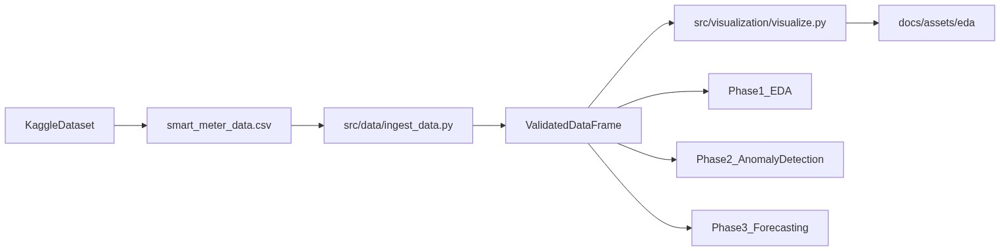
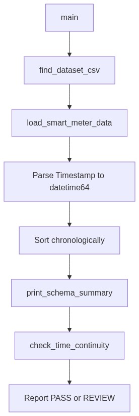

# Architecture

Repository layout, data flow, and design decisions for Phases 1–2 (ingestion, EDA, feature engineering, anomaly detection, and clean-data pipeline).

---

## System Overview



The ingestion layer is the **single gate** between raw CSV files and all downstream work. Every notebook and script in later phases should import from `src.data.ingest_data` rather than reading CSVs directly.

---

## Repository Layout

```
energy-anomaly-forecasting/
├── data/
│   ├── raw/                          # Canonical location for raw CSV (optional)
│   └── processed/                    # Generated clean CSV (gitignored)
├── docs/                             # Project documentation (MkDocs source)
│   └── assets/                       # Screenshots and static assets
│       └── eda/                      # Phase 1 Week 2 EDA figures (PNG)
├── notebooks/
│   ├── 01_data_ingestion_and_schema_check.ipynb
│   ├── 02_exploratory_data_analysis.ipynb
│   └── 03_anomaly_detection.ipynb
├── scripts/
│   ├── export_eda_assets.py          # Regenerate EDA doc figures
│   ├── verify_features.py            # Sanity-check engineered features
│   ├── test_isolation_forest.py      # Isolation Forest baseline + evaluation
│   ├── tune_isolation_forest.py      # Enhanced IF hyperparameter + threshold tuning
│   ├── tune_dbscan.py                # DBSCAN hyperparameter grid search
│   ├── tune_ensemble.py              # IF + DBSCAN ensemble comparison
│   ├── compare_anomaly_models.py     # Legacy vs enhanced research dashboard
│   └── generate_clean_data.py        # Generate Phase 3 clean dataset artifact
├── src/
│   ├── __init__.py
│   ├── data/
│   │   ├── __init__.py
│   │   ├── ingest_data.py            # Canonical ingestion module
│   │   └── clean_data.py             # Anomaly masking and interpolation
│   ├── features/
│   │   ├── __init__.py
│   │   └── build_features.py         # Phase 2 feature engineering
│   ├── models/
│   │   ├── __init__.py
│   │   ├── evaluate_models.py        # Imbalance-aware evaluation metrics
│   │   ├── train_anomaly_models.py   # Unsupervised anomaly training
│   │   ├── anomaly_preprocessing.py  # Train-fitted scaling for tuning
│   │   ├── tuning_utils.py           # Temporal splits and threshold search
│   │   └── anomaly_config.py         # Research-tuned hyperparameters
│   └── visualization/
│       ├── __init__.py
│       └── visualize.py              # EDA plotting functions
├── Smart Meter Electricity Consumption Dataset/
│   └── smart_meter_data.csv          # Current raw data location
├── .gitignore
├── LICENSE
├── mkdocs.yml
├── README.md
└── requirements.txt
```

### Directory rationale

| Path | Purpose |
|------|---------|
| `src/` | Reusable, importable Python modules |
| `notebooks/` | Interactive workflows for exploration and reporting |
| `data/raw/` | Future canonical storage for raw files |
| `docs/` | Human-readable documentation source |
| `docs/assets/eda/` | Exported EDA plots for MkDocs |
| `src/features/` | Model-ready feature engineering (Phase 2) |
| `src/models/` | Unsupervised anomaly detection and evaluation (Phase 2) |
| `scripts/` | CLI utilities (EDA export, feature verification, model testing) |
| `Smart Meter Electricity Consumption Dataset/` | Legacy download location; supported by dynamic discovery |

---

## Ingestion Pipeline



### Module: `src/data/ingest_data.py`

| Function | Responsibility |
|----------|----------------|
| `get_project_root()` | Resolve repository root from module location |
| `find_dataset_csv(root)` | Dynamically locate CSV with fallback search paths |
| `load_smart_meter_data(csv_path)` | Read CSV, parse timestamps, sort rows |
| `print_schema_summary(df)` | Report shape, columns, dtypes, null counts |
| `check_time_continuity(df)` | Validate 30-minute cadence, gaps, duplicates |
| `main()` | CLI entry point orchestrating the full pipeline |

**CLI usage:**

```bash
python -m src.data.ingest_data
```

---

## Visualization Module

### Module: `src/visualization/visualize.py`

| Function | Responsibility |
|----------|----------------|
| `add_temporal_features(df)` | Derive hour, day-of-week, and weekend flags |
| `plot_feature_histograms(df)` | Numeric feature distributions with KDE |
| `plot_hourly_load_profile(df)` | Daily load profile boxplot by hour |
| `plot_weekly_load_profile(df)` | Weekly seasonality boxplot by day |
| `plot_correlation_heatmap(df)` | Pearson correlation matrix heatmap |
| `plot_anomaly_label_distribution(df)` | Bar chart of Normal vs Abnormal counts |
| `plot_consumption_timeseries(df)` | Time series with rolling mean overlay |

**Asset export:**

```bash
python scripts/export_eda_assets.py
```

Writes PNGs to `docs/assets/eda/` for embedding in [EDA Insights](eda-insights.md).

---

## Feature Engineering Module

### Module: `src/features/build_features.py`

| Function | Responsibility |
|----------|----------------|
| `add_temporal_features(df)` | Derive `hour`, `day_of_week`, `month`, and `is_weekend` integer columns from `Timestamp` |
| `add_rolling_metrics(df)` | Derive 3-hour and 24-hour rolling mean / standard deviation over `Electricity_Consumed` (chronologically sorted) |
| `build_all_features(df)` | Apply temporal then rolling features in one call |

See [Feature Engineering](feature-engineering.md) for design notes and verification output.

**Verification:**

```bash
python scripts/verify_features.py
```

Loads the dataset via `src.data.ingest_data`, applies both feature functions, and asserts column presence, value ranges, and NaN warm-up behavior.

---

## Models Module

### Module: `src/models/`

| Function | Module | Responsibility |
|----------|--------|----------------|
| `evaluate_anomaly_model(y_true, y_pred)` | `evaluate_models.py` | Precision, recall, F1, confusion matrix (Abnormal = positive class) |
| `prepare_feature_matrix(df)` | `train_anomaly_models.py` | Numeric training matrix; drops label, timestamp, and NaN warm-up rows |
| `train_isolation_forest(df)` | `train_anomaly_models.py` | Unsupervised Isolation Forest fit; returns model and 0/1 predictions |
| `train_dbscan(df)` | `train_anomaly_models.py` | Unsupervised DBSCAN fit; noise points mapped to Abnormal |
| `detect_anomalies(df, model_type)` | `train_anomaly_models.py` | Unified router to Isolation Forest, DBSCAN, or ensemble |
| `train_ensemble(df, ...)` | `train_anomaly_models.py` | IF + DBSCAN intersection/union/weighted |
| `AnomalyPreprocessor` | `anomaly_preprocessing.py` | Train-only StandardScaler + hourly z-score |

See [Anomaly Detection](anomaly-detection.md) for baseline results and design notes.

**Baseline verification:**

```bash
python scripts/test_isolation_forest.py
python scripts/tune_dbscan.py --legacy
python scripts/tune_isolation_forest.py
python scripts/tune_ensemble.py
python scripts/compare_anomaly_models.py
```

Loads data, applies features, trains unsupervised detectors (labels excluded), and prints imbalance-aware metrics against the benchmark.

---

## Clean Data Module

### Module: `src/data/clean_data.py`

| Function | Responsibility |
|----------|----------------|
| `interpolate_anomalies(df, predictions)` | Mask anomalous `Electricity_Consumed` values; time-interpolate gaps |
| `generate_clean_dataset(input_path, output_path)` | End-to-end IF clean pipeline; writes CSV artifact |

See [Clean Dataset](clean-data.md) for pipeline design and artifact details.

**Artifact generation:**

```bash
python scripts/generate_clean_data.py
```

Writes `data/processed/clean_smart_meter_data.csv` (5000 rows, imputed consumption, gitignored locally).

---

## Design Decisions

### Canonical source vs. notebook duplication

| Artifact | Role |
|----------|------|
| `src/data/ingest_data.py` | **Canonical source** — import in scripts, tests, and future modules |
| `notebooks/01_data_ingestion_and_schema_check.ipynb` | **Portable copy** — inline functions for Colab/Kaggle where `src/` may not be on `PYTHONPATH` |
| `notebooks/03_anomaly_detection.ipynb` | **Phase 2 tutorial** — imports `detect_anomalies`, `evaluate_anomaly_model`, and `interpolate_anomalies` from `src/`; educational mirror of the verification scripts |
| `src/visualization/visualize.py` | **Canonical EDA plots** — shared by notebook and export script |

When ingestion or visualization logic changes, update the Python module first, then sync the notebook.

### Dynamic CSV discovery

Hard-coding absolute paths breaks portability across local, Colab, and Kaggle environments. `find_dataset_csv()` searches multiple candidate locations in priority order so the same code works regardless of where the user placed the download.

### Phase gate: schema before EDA

No exploratory analysis or modeling runs until:

- Schema completeness is verified (7 columns, zero nulls)
- Time-series continuity passes (30-minute intervals, no gaps)

This prevents silent data quality issues from propagating into Phase 2 and Phase 3.

### Documentation figures from scripts

EDA plots in MkDocs are generated by `scripts/export_eda_assets.py` rather than extracted from notebook outputs. This keeps figures reproducible and avoids committing large base64 blobs in `.ipynb` files.

### Git hooks (developer-local, not in repository)

Commit-message hooks (e.g. stripping unwanted `Co-authored-by` trailers) are **not** versioned in this repository. Each developer may install a personal global template:

```powershell
New-Item -ItemType Directory -Force -Path "$env:USERPROFILE\.git-template\hooks"
# copy your commit-msg hook into that folder
git config --global init.templateDir "$env:USERPROFILE\.git-template"
```

The `.githooks/` directory is listed in `.gitignore` for optional local use only.

---

## Phase Roadmap

| Phase | Deliverables | Key modules |
|-------|-------------|-------------|
| **1 — Setup & EDA** | Ingestion, schema validation, EDA, documentation | `src/data/ingest_data.py`, `src/visualization/visualize.py` |
| **2 — Anomaly Detection** | Feature engineering, IF/DBSCAN, clean dataset, educational notebook | `src/features/build_features.py`, `src/models/train_anomaly_models.py`, `src/data/clean_data.py`, `notebooks/03_anomaly_detection.ipynb` |
| **3 — Forecasting** | XGBoost, LSTM, evaluation | `src/models/` (planned) |

---

## Technology Stack

| Component | Library | Version constraint |
|-----------|---------|-------------------|
| Data manipulation | pandas | >= 2.0.0 |
| Numerical computing | numpy | >= 1.24.0 |
| Environment config | python-dotenv | >= 1.0.0 |
| Notebooks | jupyter, ipykernel | >= 1.0.0, >= 6.0.0 |
| Visualization | matplotlib, seaborn | >= 3.7.0, >= 0.13.0 |
| Statistics | scipy, statsmodels | >= 1.11.0, >= 0.14.0 |
| Anomaly detection | scikit-learn | >= 1.3.0 |
| Documentation | mkdocs, mkdocs-material | >= 1.6.0, >= 9.5.0 |

Forecasting libraries (xgboost, tensorflow/pytorch) will be added in Phase 3.
