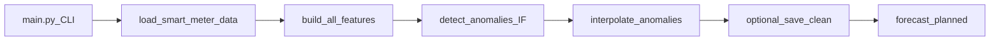

# E2E Pipeline — Phase 3, Week 8 (Days 2–3)

Working notes for the root **`main.py`** entry point that consolidates the Phase 1–3 workflow into a single CLI command. Day 2 scaffolds argparse, logging, ingestion, and features. Day 3 wires Isolation Forest detection, in-memory interpolation, and an optional clean-data checkpoint.

<div class="admonition success" markdown="1">
<p class="admonition-title">Executive summary</p>

- **One command:** `python main.py` is the user-facing entry point at the repository root.
- **Days 2–3 scope:** CLI + INFO logging + ingest + features + **Isolation Forest** + **time interpolation** in memory; optional `--save_clean_data`.
- **Verified shapes:** Raw `(5000, 7)` → engineered `(5000, 15)` → clean in-memory `(5000, 15)` with **0** consumption NaNs after interpolate.
- **Reserved flags:** `--model` and `--epochs` are parsed but not yet used for training (Day 4).
- **Terms:** [Glossary](glossary.md) — E2E pipeline / main.py, clean_pipeline_output, Isolation Forest.

</div>

**Status:** Week 8 Days 2–3 complete — through anomaly detection, cleaning, and optional save  
**Entry point:** `main.py` (repository root)  
**Modules:** `src.data.ingest_data`, `src.features.build_features`, `src.models.train_anomaly_models`, `src.data.clean_data`  
**Builds on:** [Getting Started](getting-started.md), [Feature Engineering](feature-engineering.md), [Anomaly Detection](anomaly-detection.md), [Clean Dataset](clean-data.md)

---

## End-to-End Pipeline (current vs planned)

```text
python main.py [--data_path ...] [--model ...] [--epochs ...] [--save_clean_data]
  → load_smart_meter_data(data_path)     # Phase 1 — raw (5000, 7)
  → build_all_features(df)               # Phase 2 early — (5000, 15)
  → detect_anomalies(..., isolation_forest)
  → interpolate_anomalies(df_feat, predictions)   # clean in memory
  → [optional] save data/processed/clean_pipeline_output.csv
  → [planned] forecast with --model / --epochs
```



`main.py` delegates to `src/` — it does **not** reimplement ingestion, detection, or interpolation logic.

---

## CLI Reference

| Argument | Type | Default | Role |
|----------|------|---------|------|
| `--data_path` | `Path` | `Smart Meter Electricity Consumption Dataset/smart_meter_data.csv` | Path to the smart meter CSV |
| `--model` | choice | `naive` | Reserved: `naive`, `prophet`, `xgboost`, `lstm` |
| `--epochs` | `int` | `20` | Reserved: LSTM training epochs |
| `--save_clean_data` | flag | off | Save interpolated frame to `data/processed/clean_pipeline_output.csv` |

```bash
python main.py
python main.py --save_clean_data
python main.py --model lstm --epochs 30
python main.py --data_path path/to/smart_meter_data.csv
```

On Windows:

```powershell
.venv\Scripts\activate
python main.py --save_clean_data
```

---

## Logging

Configured at module load:

```python
logging.basicConfig(level=logging.INFO, format="%(levelname)s: %(message)s")
```

Pipeline messages use `logger.info(...)` rather than `print()`.

### Example run (local, reproducible)

```text
INFO: E2E pipeline starting (model=naive, epochs=20, data_path=..., save_clean_data=True)
INFO: Starting data ingestion from ... ...
INFO: Raw data loaded: shape=(5000, 7)
INFO: Building temporal and rolling features ...
INFO: Feature matrix ready: shape=(5000, 15) (47 rows with rolling-window warm-up NaNs; ...)
INFO: Running Isolation Forest anomaly detection ...
INFO: Anomalies detected: 248 of 4953 scored rows
INFO: Masking anomalies and time-interpolating Electricity_Consumed ...
INFO: Clean in-memory dataset ready: shape=(5000, 15), consumption_NaNs=0
INFO: Saved clean pipeline output to ...\data\processed\clean_pipeline_output.csv
```

Anomaly count is an **example** local run at default `contamination=0.05`; re-runs may differ slightly with library versions.

---

## Ingestion and Feature Engineering

| Step | API | Expected result |
|------|-----|-----------------|
| Load | `load_smart_meter_data(data_path)` | Shape `(5000, 7)`, parsed `Timestamp` |
| Features | `build_all_features(df)` | Shape `(5000, 15)` — temporal + rolling columns |

**Warm-up NaNs:** Rolling windows leave the first incomplete rows as NaN (**47** rows on the default dataset). Day 2 logs this count and **does not drop** rows.

---

## Anomaly Detection and Cleaning (Day 3)

| Step | API | Expected result |
|------|-----|-----------------|
| Detect | `detect_anomalies(df_feat, model_type="isolation_forest")` | Binary predictions (`1` = Abnormal) on **scored** rows after warm-up (~**4953**) |
| Clean | `interpolate_anomalies(df_feat, predictions)` | Same shape `(5000, 15)`; anomalous consumption masked then time-interpolated |

**Scored rows vs full timeline:** Isolation Forest drops rolling warm-up rows before fit/predict. `interpolate_anomalies` aligns the shorter prediction array to evaluable indices; warm-up rows keep original consumption. Full row count stays **5000**.

Individual scripts (`scripts/test_isolation_forest.py`, `scripts/generate_clean_data.py`) remain valid for focused Phase 2 work. `main.py` is the consolidating in-memory path.

---

## Optional Clean Checkpoint

```bash
python main.py --save_clean_data
```

Writes `data/processed/clean_pipeline_output.csv` (directory created if needed). The `data/processed/` folder is gitignored.

| Artifact | Produced by | Role |
|----------|-------------|------|
| `clean_smart_meter_data.csv` | `scripts/generate_clean_data.py` | **Production** Phase 3 baseline used by forecast scripts |
| `clean_pipeline_output.csv` | `main.py --save_clean_data` | **Optional E2E checkpoint** — same `interpolate_anomalies` helper, different entry point |

Do not treat the E2E checkpoint as a drop-in replacement for the production clean artifact unless you intentionally re-point forecast scripts.

---

## What's Next

Per [Phase 3 Strategy](phase3-strategy.md) E2E consolidation:

1. Wire chronological split and `--model` forecasting (naive / Prophet / XGBoost / LSTM) — Day 4
2. Research write-up and tutorial notebook (`forecasting-research.md`, `04_forecasting_tutorial.ipynb`)

---

<details class="info" markdown="1">
<summary>Technical deep dive</summary>

**Modularity:** `main.py` imports public helpers only — `load_smart_meter_data`, `build_all_features`, `detect_anomalies`, `interpolate_anomalies`.

**CLI parsing:** `parse_args()` returns `data_path`, `model`, `epochs`, and `save_clean_data`.

**Warm-up count:** `int(df_feat.isna().any(axis=1).sum())` after features — typically 47 on the 5,000-row Kaggle CSV.

**Detection default:** `model_type="isolation_forest"` with production contamination **0.05**.

**Commands:**

```bash
python main.py
python main.py --save_clean_data
python main.py --help
```

</details>

---

## References

- [Getting Started](getting-started.md) — install and Phase 3 run commands
- [Feature Engineering](feature-engineering.md) — temporal and rolling columns
- [Anomaly Detection](anomaly-detection.md) — Isolation Forest baseline
- [Clean Dataset](clean-data.md) — production clean artifact vs E2E checkpoint
- [Forecast Model Comparison](forecast-model-comparison.md) — research ladder aggregator (separate from E2E CLI)
- [Phase 3 Strategy](phase3-strategy.md) — model ladder and consolidation plan
- [Architecture](architecture.md) — repository layout
- [Glossary](glossary.md) — E2E pipeline / main.py, clean_pipeline_output
