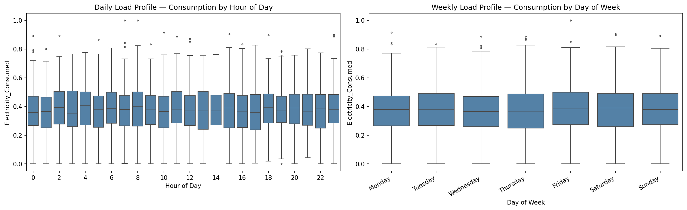
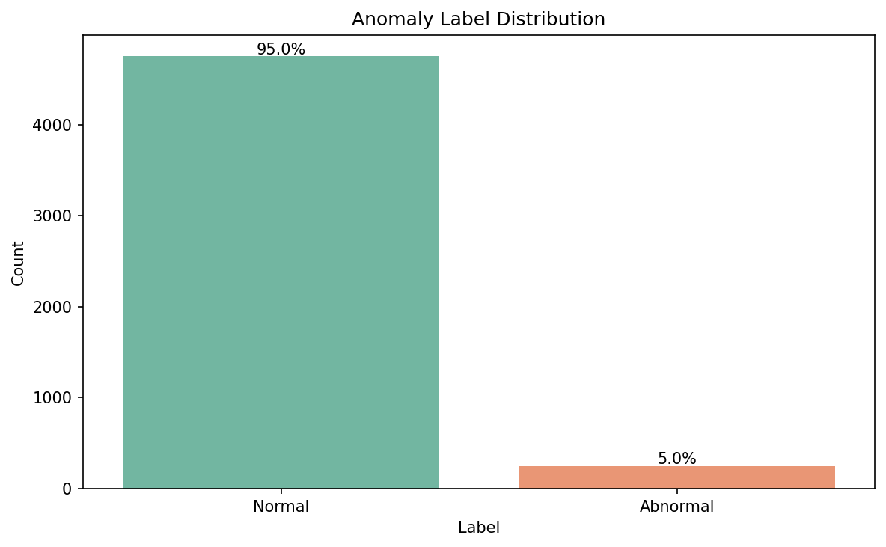
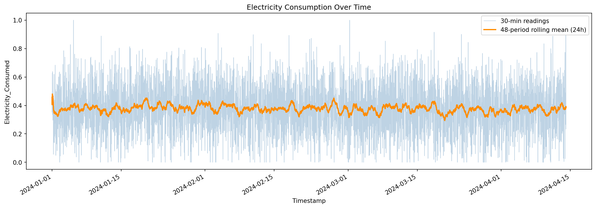
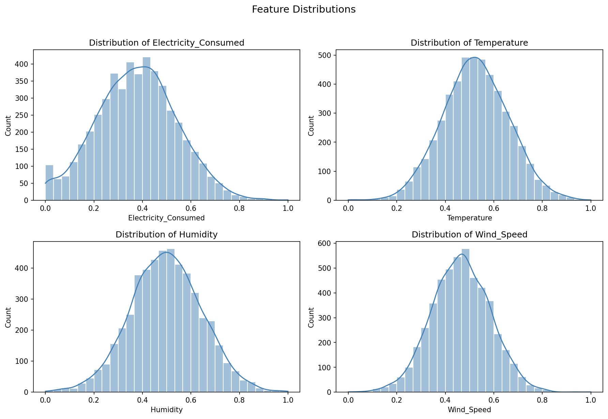

# EDA Insights — Phase 1, Week 2

I ran exploratory analysis on the public Kaggle Smart Meter Electricity Consumption Dataset after Week 1 ingestion passed. These are the findings I'm basing the Phase 2 anomaly detection design on.

!!! success "Executive summary"

    - **Data quality:** Zero missing values, perfect 30-minute continuity — safe to model without heavy cleanup.
    - **Load pattern:** Peak consumption around **2 AM**; weekends slightly higher than weekdays.
    - **Weather:** Weak linear link to consumption on this normalized slice — multivariate detection still worth testing.
    - **Anomaly rate:** Only **~5%** labeled abnormal — evaluation must account for imbalance.
    - **Terms:** [Glossary](glossary.md) — contamination, Pearson correlation.

**Analysis date:** Phase 1, Week 2  
**Dataset:** 5,000 rows, 30-minute intervals, Jan 1 – Apr 14, 2024  
**Tools:** `notebooks/02_exploratory_data_analysis.ipynb`, `src/visualization/visualize.py`

---

## Summary

The dataset is clean (zero nulls, perfect 30-minute continuity) with normalized numeric features. Consumption shows modest diurnal variation, weak weekly seasonality, near-zero linear correlation with weather variables, and a strong relationship with `Avg_Past_Consumption`. The anomaly label is imbalanced at 5% `Abnormal` — a key constraint for Phase 2 evaluation.

---

## 1. Daily Load Profile (Peak Consumption Hours)

**Method:** Boxplot of `Electricity_Consumed` by hour of day (0–23), derived via `add_temporal_features()`.



**Figure 1.** Daily load profile (left): consumption boxplots by hour of day. Weekly load profile (right): consumption by day of week.

**Findings:**

| Metric | Value |
|--------|-------|
| Peak mean consumption hour | **02:00** (hour 2) |
| Peak mean consumption | **0.398** (normalized) |
| Secondary peaks | Hours 11 and 6 (0.390, 0.389) |

**Interpretation:** On normalized synthetic data, diurnal variation is present but moderate. The highest mean consumption occurs in the early morning (02:00), with secondary peaks mid-morning and early morning. Phase 2 anomaly detectors should account for hour-of-day baselines rather than treating all intervals as exchangeable.

---

## 2. Weekly Seasonality (Weekdays vs Weekends)

**Method:** Boxplot by day of week; compare weekday vs weekend means (see right panel of Figure 1).

**Findings:**

| Group | Mean `Electricity_Consumed` |
|-------|----------------------------|
| Weekdays (Mon–Fri) | **0.375** |
| Weekends (Sat–Sun) | **0.380** |
| Highest day | **Friday** (0.385) |
| Lowest day | **Wednesday** (0.366) |

**Interpretation:** Weekly seasonality is subtle — weekend mean consumption is slightly higher than weekday (+1.3%). Day-to-day spread is narrow (~0.019 range). Unlike typical residential load profiles with strong weekday/weekend separation, this dataset shows relatively flat weekly patterns, likely due to normalization or synthetic generation.

---

## 3. Weather–Consumption Relationships

**Method:** Pearson correlation heatmap for numeric features.


**Figure 2.** Pearson correlation matrix for consumption, weather, and historical average features.

**Findings — correlation with `Electricity_Consumed`:**

| Feature | Correlation |
|---------|-------------|
| `Avg_Past_Consumption` | **+0.317** |
| `Wind_Speed` | +0.001 |
| `Humidity` | -0.003 |
| `Temperature` | -0.003 |

**Interpretation:** Weather variables (Temperature, Humidity, Wind_Speed) show **negligible linear correlation** with consumption in this normalized dataset. `Avg_Past_Consumption` — a rolling historical average — is the strongest linear predictor, as expected. Phase 2 unsupervised methods should not rely on weather alone for anomaly scoring; multivariate patterns including consumption history matter more.

---

## 4. Baseline Anomaly Rate

**Method:** Value counts on `Anomaly_Label` (`Normal` / `Abnormal`).



**Figure 3.** Count of pre-assigned anomaly labels with percentage annotations.

**Findings:**

| Label | Count | Percentage |
|-------|-------|------------|
| `Normal` | 4,750 | **95.0%** |
| `Abnormal` | 250 | **5.0%** |
| Imbalance ratio | 19 : 1 | Normal : Abnormal |

**Interpretation:** The dataset is **imbalanced** with 5% abnormal intervals. Phase 2 evaluation metrics must go beyond accuracy (e.g., precision, recall, F1 for the minority class). Unsupervised detectors (Isolation Forest, DBSCAN) will not use this label for training but should be benchmarked against it.

---

## 5. Time-Series Overview

**Method:** Full-series line plot with 48-period (24-hour) rolling mean.



**Figure 4.** Raw 30-minute consumption readings with 48-period (24-hour) rolling mean overlay.

**Findings:**

- The series spans ~104 days with no visible gaps (consistent with Week 1 continuity PASS).
- Rolling average smooths 30-minute noise and reveals stable consumption levels without dramatic regime shifts.
- No obvious structural breaks or long-term trends in the normalized consumption signal.

---

## 6. Feature Distribution Notes

**Method:** Histograms with KDE overlays for numeric consumption and weather features.



**Figure 5.** Distribution of `Electricity_Consumed`, `Temperature`, `Humidity`, and `Wind_Speed`.

All numeric features (`Electricity_Consumed`, `Temperature`, `Humidity`, `Wind_Speed`) are approximately uniformly distributed in the 0–1 range, consistent with prior normalization. No heavy skewness or extreme outliers visible in histograms — appropriate for distance-based anomaly methods in Phase 2.

---

## Limitations

1. **Normalized features** — values are scaled (~0–1); physical units (kWh, °C) are unavailable.
2. **Single aggregate series** — one meter stream, not multi-household.
3. **Pre-assigned labels** — `Anomaly_Label` was generated externally (Isolation Forest per dataset documentation); Phase 2 will use unsupervised methods independently.
4. **Linear correlation only** — heatmap captures Pearson coefficients; non-linear weather effects may exist but are not visible here.

---

## Recommendations for Phase 2

1. Include **hour-of-day** and **day-of-week** as context features or stratification for anomaly scoring.
2. Prioritize **multivariate** features (`Electricity_Consumed`, `Avg_Past_Consumption`) over weather alone.
3. Use **imbalance-aware evaluation** (precision/recall/F1 on `Abnormal` class).
4. Do not treat **5% abnormal rate** as expected detection rate — unsupervised methods may differ.

---

## Reproducibility

Regenerate all figures and verify metrics:

```bash
pip install -r requirements.txt
python scripts/export_eda_assets.py
```

Interactive analysis:

```bash
jupyter notebook notebooks/02_exploratory_data_analysis.ipynb
```

Or run programmatically via `src.visualization.visualize` functions after loading with `src.data.ingest_data`.

??? info "Technical deep dive"

    **Figures:** `docs/assets/eda/` — regenerated by `python scripts/export_eda_assets.py`.

    **Correlation table:** Pearson r on normalized columns; strongest pair: `Electricity_Consumed` vs `Avg_Past_Consumption` (**+0.317**).

    **Notebook:** `notebooks/02_exploratory_data_analysis.ipynb` — same logic as exported assets.
