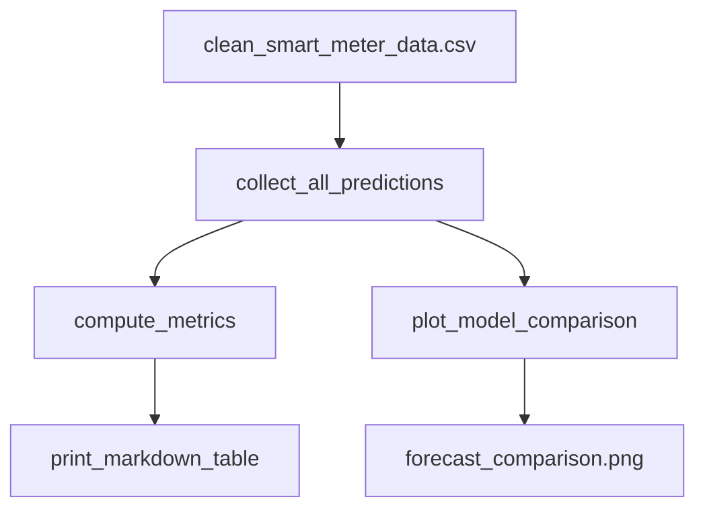
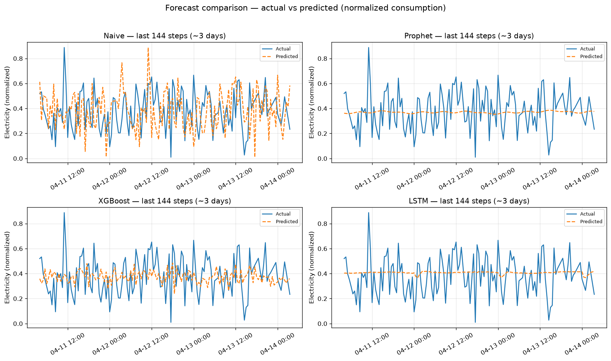

# Forecast Model Comparison — Phase 3, Week 8 (Day 1)

Working notes for the unified script that runs **Naive**, **Prophet**, **XGBoost**, and **LSTM** on their native test pipelines, prints a copy-paste Markdown metrics table, and saves a presentation-ready comparison plot.

<div class="admonition success" markdown="1">
<p class="admonition-title">Executive summary</p>

- **One script, four models:** `compare_forecasts.py` aggregates the full Phase 3 forecasting ladder for research reporting.
- **Copy-paste metrics:** Console prints a Markdown table (MAE / RMSE) ready for MkDocs or grant write-ups.
- **Presentation plot:** 2×2 subplot chart saved to `docs/assets/forecast_comparison.png` — last **3 days** (144 steps) of each model's test window.
- **Headline result:** Prophet leads MAE/RMSE on this run; LSTM beats naive and XGBoost; all advanced models beat the naive floor.
- **Terms:** [Glossary](glossary.md) — forecast model comparison, normalized forecast metrics, MAE, RMSE.

</div>

**Status:** Week 8 Day 1 complete — unified prediction collection, metrics table, visualization  
**Script:** `scripts/compare_forecasts.py`  
**Asset:** `docs/assets/forecast_comparison.png`  
**Builds on:** [Forecasting Baseline](forecasting-baseline.md), [Prophet Baseline](prophet-baseline.md), [XGBoost Forecasting](xgboost-forecasting.md), [LSTM Forecasting](lstm-forecasting.md)

---

## End-to-End Pipeline

```text
clean CSV (5000 rows)
  → collect_all_predictions()
      naive:   raw time_series_split → naive_seasonal_forecast
      prophet: raw split → train_prophet_model
      xgboost: create_supervised_lags → split → train_xgboost_model
      lstm:    create_sequences → sequence split → train → predict_lstm
  → compute_metrics()           # evaluate_forecast per model
  → print_markdown_table()        # console Markdown
  → plot_model_comparison()       # docs/assets/forecast_comparison.png
```



---

## Per-Model Native Test Pipelines

Each model uses the **same** chronological split fractions (70 / 15 / 15) but may differ in warm-up rows — identical to the individual `evaluate_*` scripts:

| Model | Pipeline | Test rows | Test window start (example) |
|-------|----------|-----------|----------------------------|
| Naive | Raw `time_series_split` → 48-step seasonal persistence | **750** | 2024-03-29 13:00 |
| Prophet | Raw split → `train_prophet_model` | **750** | 2024-03-29 13:00 |
| XGBoost | `create_supervised_lags` → split → `XGBRegressor` | **743** | 2024-03-29 16:30 |
| LSTM | `create_sequences` → sequence split → `EnergyLSTM` | **747** | 2024-03-29 14:30 |

**Fair comparison note:** Metrics are computed **per model** on its native held-out test window via `evaluate_forecast`. Row counts differ slightly because lag and sequence warm-up drop the earliest incomplete rows — this matches how each model was originally validated.

Each model's predictions are stored as a DataFrame with columns: `timestamp`, `y_true`, `y_pred`.

---

## Run the Comparison

```bash
python scripts/compare_forecasts.py
```

On Windows:

```powershell
.venv\Scripts\activate
python scripts/compare_forecasts.py
```

**Requirements:** Project `.venv` with `prophet>=1.1.5`, `xgboost>=2.0.0`, and `torch>=2.0.0`.

**Runtime:** ~1–2 minutes on CPU (LSTM trains for 20 epochs each run).

**Expected output:**

1. Per-model progress (`Running naive...`, `Running Prophet...`, etc.)
2. LSTM epoch loss lines (20 epochs)
3. Prediction row counts and timestamp ranges
4. Markdown metrics table (copy into docs)
5. `Saved comparison plot: .../docs/assets/forecast_comparison.png`
6. `PASS — predictions collected, metrics table and plot generated.`

Re-run to refresh metrics and the PNG after regenerating the clean artifact.

---

## Example Metrics (local, reproducible)

| Model | MAE | RMSE | Test rows |
|-------|-----|------|-----------|
| Naive | 0.171150 | 0.214034 | 750 |
| Prophet | **0.121071** | **0.148670** | 750 |
| XGBoost | 0.125274 | 0.153876 | 743 |
| LSTM | 0.122156 | 0.151200 | 747 |

MAPE is computed internally but **not** recommended for headline reporting on this normalized dataset (near-zero true values inflate percentage error).

**Interpretation:**

- All advanced models beat the **naive seasonal floor** on MAE and RMSE.
- **Prophet** leads on both metrics for this default hyperparameter run.
- **LSTM** is competitive — beats XGBoost and sits close to Prophet.
- Metrics are on **normalized** consumption (0–1 scale); see [Glossary — normalized forecast metrics](glossary.md).

---

## API Reference

Module: `scripts/compare_forecasts.py`

| Function | Role |
|----------|------|
| `collect_all_predictions(df)` | Run all four forecasters; return `dict[str, pd.DataFrame]` |
| `compute_metrics(predictions)` | Call `evaluate_forecast` per model |
| `print_markdown_table(results)` | Print copy-pasteable Markdown table to stdout |
| `plot_model_comparison(predictions)` | 2×2 subplots; last **144** steps (~3 days at 30-min resolution) |

Supporting helpers reused from individual pipelines: `run_naive_forecast`, `run_prophet_forecast`, `run_xgboost_forecast`, `run_lstm_forecast`, `split_sequence_arrays`.

**Related API added in Week 8 Step 1:** `predict_lstm` in `src/models/train_forecast_models.py` — inference helper for LSTM test batches.

---

## Visualization



**How to read the chart:**

- **Layout:** 2×2 subplots — one panel per model (Naive, Prophet, XGBoost, LSTM).
- **Window:** Last **144** timesteps (~**3 days**) of each model's test set for readability.
- **Lines:** Solid blue = actual consumption; dashed orange = predicted.
- **Naive panel:** Predictions track spikes with a **one-step lag** — expected for seasonal persistence (value at *t* equals observation at *t − 48*).
- **Prophet / LSTM panels:** Smoother predictions — better average error (MAE/RMSE) but less reactive to high-frequency spikes in this normalized series.
- **XGBoost panel:** Intermediate — captures some variation via lag features.

Regenerate after code or data changes:

```bash
python scripts/compare_forecasts.py
python scripts/export_xgboost_feature_importance.py   # research importance PNG
```

---

## Relationship to Individual Scripts

| Script | Scope |
|--------|-------|
| `evaluate_naive_baseline.py` | Naive floor only |
| `evaluate_prophet.py` | Prophet only |
| `evaluate_xgboost.py` | XGBoost only |
| **`compare_forecasts.py`** | **All four models** — research / reporting aggregator |

Use individual scripts for quick single-model checks; use the comparison script for the definitive ladder table and presentation figure.

---

## What's Next

Per [Phase 3 Strategy](phase3-strategy.md):

1. ~~**E2E pipeline consolidation**~~ — **done:** [E2E Pipeline](e2e-pipeline.md) (Days 2–5); `compare_forecasts.py` remains the side-by-side MAE/RMSE ladder aggregator
2. ~~Tutorial notebook~~ — **done:** [Forecasting Tutorial](forecasting-tutorial.md)
3. ~~Research write-up~~ — **done:** [Forecasting Research](forecasting-research.md)
4. Hyperparameter tuning across models
5. Optional: aligned timestamp intersection for single-panel overlay plots

The **model ladder**, **E2E CLI** (Week 8 Days 2–5), **forecasting tutorial**, and **research write-up** (Week 9) are complete.

---

<details class="info" markdown="1">
<summary>Technical deep dive</summary>

**Dependencies guard:** Script fails fast with venv guidance if `prophet`, `xgboost`, or `torch` is missing from the active interpreter.

**Plot backend:** Uses `matplotlib` Agg backend for headless PNG export (same pattern as `export_eda_assets.py`).

**Output path:** `docs/assets/forecast_comparison.png` (120 DPI, tight bounding box).

**Console Markdown table format:**

```markdown
| Model | MAE | RMSE | MAPE (%) |
|-------|-----|------|----------|
| Naive | 0.171150 | 0.214034 | ... |
```

Copy the printed block directly into MkDocs pages or research documents.

**Commands:**

```bash
python scripts/compare_forecasts.py
python scripts/export_xgboost_feature_importance.py
mkdocs serve   # preview docs with embedded PNGs
```

</details>

---

## References

- [Forecasting Baseline](forecasting-baseline.md) — naive floor and split protocol
- [Prophet Baseline](prophet-baseline.md) — statistical baseline
- [XGBoost Forecasting](xgboost-forecasting.md) — tabular gradient-boosted model
- [LSTM Prep](lstm-prep.md) — 3D sequence generation
- [LSTM Forecasting](lstm-forecasting.md) — recurrent model training and inference
- [E2E Pipeline](e2e-pipeline.md) — Week 8 Days 2–5 root CLI (ingest → forecast → metrics → CSV)
- [Forecasting Tutorial](forecasting-tutorial.md) — Week 9 CMU educational notebook
- [Forecasting Research](forecasting-research.md) — Week 9 research write-up
- [Phase 3 Strategy](phase3-strategy.md) — model ladder and evaluation protocol
- [Architecture](architecture.md) — repository layout and script inventory
- [Glossary](glossary.md) — MAE, RMSE, forecast model comparison
- [Getting Started](getting-started.md) — Phase 3 run commands
