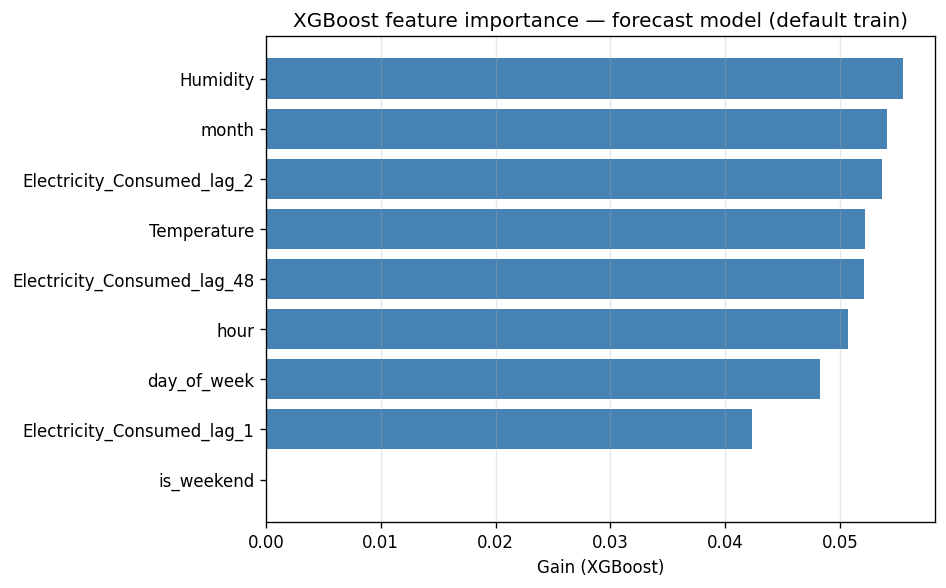

# Forecasting Research — Phase 3 Findings

Research notes on what Phase 3 actually taught us about forecasting half-hour smart-meter load. Phase 2 left a continuous cleaned timeline; this page asks how predictable that series is once anomalies are repaired — and which model on our ladder earns the headline.

!!! success "Executive summary"

    - **Question:** On the production clean CSV, how well can we forecast the next intervals — and which model wins under our default protocol?
    - **Protocol:** Chronological train / val / test; score native test windows with MAE and RMSE via `compare_forecasts.py`.
    - **Headline:** **Prophet** leads MAE and RMSE on the Week 8 default run; LSTM is close; all advanced models beat the naive seasonal floor.
    - **Terms:** [Glossary](glossary.md) — MAE, RMSE, seasonal naive, forecast model comparison.

**Status:** Week 9 Days 3–4 — research write-up in progress  
**Builds on:** [Forecast Model Comparison](forecast-model-comparison.md), [Forecasting Baseline](forecasting-baseline.md), [Phase 3 Strategy](phase3-strategy.md), [Clean Dataset](clean-data.md)

---

## What Phase 2 Handed Off

I'm not starting forecasting from a broken timeline. Phase 2's production artifact — `data/processed/clean_smart_meter_data.csv` — keeps all 5,000 half-hour rows, fills flagged consumption with time interpolation, and leaves the meter stream continuous. That matters: a forecaster that trains on gaps or deleted anomaly rows is answering a different question than “what does demand look like next?”

Phase 3's job was narrower than inventing new cleaning recipes. It was: **given this cleaned series, how predictable is load**, and does a model ladder (naive → Prophet → XGBoost → LSTM) beat a honest seasonal floor without leaking the future into training?

---

## Model Ladder Results

We scored each model on its **native** chronological test pipeline — the same paths wired in [`scripts/compare_forecasts.py`](../scripts/compare_forecasts.py) and documented in [Forecast Model Comparison](forecast-model-comparison.md). Re-run locally with:

```bash
python scripts/compare_forecasts.py
```

Example test metrics from the Week 8 default hyperparameter run:

| Model | MAE | RMSE | Test rows |
|-------|-----|------|-----------|
| Naive | 0.171150 | 0.214034 | 750 |
| Prophet | **0.121071** | **0.148670** | 750 |
| XGBoost | 0.125274 | 0.153876 | 743 |
| LSTM | 0.122156 | 0.151200 | 747 |

Lower MAE and RMSE are better. Test row counts differ because XGBoost and LSTM re-split after lag / sequence warm-up — so this is **not** one shared timestamp panel; it is a fair per-model native evaluation.

### Who won — and why I'm not surprised

**Prophet wins this run** on both MAE and RMSE.

That result is sharper than “deep learning always wins.” A few observations:

- **The naive floor is real.** Seasonal persistence (repeat the value from 48 steps ago / 24 hours) is a hard baseline on a series with clear daily structure. Every advanced model clears it — if something couldn't beat ~0.171 MAE, I wouldn't trust it.
- **Prophet fits this series' shape.** The load profile is normalized, fairly smooth, and diurnal. Prophet's trend + seasonality story matches that structure without needing a large tabular feature matrix. Leading both MAE and RMSE under default settings is the honest headline.
- **LSTM is close.** At ~0.122 MAE it beats XGBoost and sits near Prophet — competitive for a small CPU-trained network, not a runaway win.
- **XGBoost is solid but third.** Lag + weather + calendar features get it past naive, yet on this default `n_estimators=100` / `learning_rate=0.1` setup it trails Prophet and LSTM on average error. Trees react to lag structure; they don't automatically invent Prophet-style global seasonality.

I'm treating Prophet as the **best default forecaster for this artifact and protocol**, not as proof that statistical models always dominate tree or sequence models. Hyperparameter search, longer horizons, or a different meter could reorder the ladder. For Week 8 as shipped: Prophet is the winner.

---

## Feature Importance: Weather vs. History

Phase 1 EDA left a clear linear story: weather columns (`Temperature`, `Humidity`, `Wind_Speed`) had **near-zero Pearson correlation** with consumption, while history (`Avg_Past_Consumption`) was the strongest linear cue. Phase 2 anomaly tuning even saw a slight F1 *uplift* when weather was dropped. So the open forecasting question was honest: did XGBoost actually use temperature and humidity, or did lag / calendar features carry the model?

I exported **gain** importance from the same default XGBoost path as [XGBoost Forecasting](xgboost-forecasting.md) — clean CSV → `create_supervised_lags` → chronological 70/15/15 → `train_xgboost_model` — via:

```bash
python scripts/export_xgboost_feature_importance.py
```



### What the chart actually says

On this default run, **gain is spread thinly across almost every feature**. Approximate ordering (low → high gain):

| Feature | Role | Gain (approx.) |
|---------|------|----------------|
| `is_weekend` | Calendar | **0** (unused) |
| `Electricity_Consumed_lag_1` | History (t−1) | ~0.042 |
| `day_of_week`, `hour` | Calendar | ~0.048–0.051 |
| `Electricity_Consumed_lag_48` | History (t−48 / 24h) | ~0.052 |
| `Temperature` | Weather | ~0.052 |
| `Electricity_Consumed_lag_2` | History (t−2) | ~0.054 |
| `month` | Calendar | ~0.054 |
| `Humidity` | Weather | ~0.055 |

A few takeaways I'm willing to stand behind:

- **History did not monopolize the tree.** `lag_1` / `lag_2` / `lag_48` matter, but they are not a runaway top cluster. Daily lag (`lag_48`) sits mid-pack next to temperature — consistent with “yesterday same time” mattering, not with “only lags matter.”
- **Weather is not dead for forecasting.** On this gain plot, `Humidity` and `Temperature` sit among the **highest** scores, even though Phase 1 linear correlation was tiny. That is not a contradiction: trees can use weak nonlinear / interaction structure that a Pearson matrix never sees. I will **not** copy the anomaly-detection “drop weather” conclusion into forecasting without a dedicated ablation.
- **Calendar is mixed.** `hour`, `day_of_week`, and `month` contribute; `is_weekend` got zero gain on this fit (redundant with `day_of_week`, or unused under these hyperparameters).
- **No single knob explains the model.** Gains from ~0.042–0.055 are close. Importance here is a diagnostic, not a license to strip the feature set to one lag column.

### Bottom line for the weather vs. history debate

For **anomaly detection**, weather looked optional. For **this XGBoost forecaster**, exogenous weather still shows up in gain alongside lag and calendar features. The predictive story looks more like “history + weak weather + calendar shared the work” than “lags carried everything.” That also helps explain why a univariate seasonal model (Prophet) can still win on MAE/RMSE: it encodes the dominant diurnal pattern without needing us to hand-craft which lag wins the importance chart.

Reproducibility note: re-running the export script can shuffle ranks slightly when gains are this close; the qualitative pattern (shared importance, weather not zero, weekend unused) is what I'm documenting.

---

## References

- [Forecast Model Comparison](forecast-model-comparison.md) — reproducible ladder script and plot
- [Forecasting Baseline](forecasting-baseline.md) — chronological split and naive floor
- [Prophet Baseline](prophet-baseline.md) — statistical trainer
- [XGBoost Forecasting](xgboost-forecasting.md) — tabular lag model
- [LSTM Forecasting](lstm-forecasting.md) — sequence model
- [EDA Insights](eda-insights.md) — Phase 1 weather vs history correlations
- [Phase 3 Strategy](phase3-strategy.md) — model ladder plan
- [Glossary](glossary.md) — MAE, RMSE, seasonal naive
