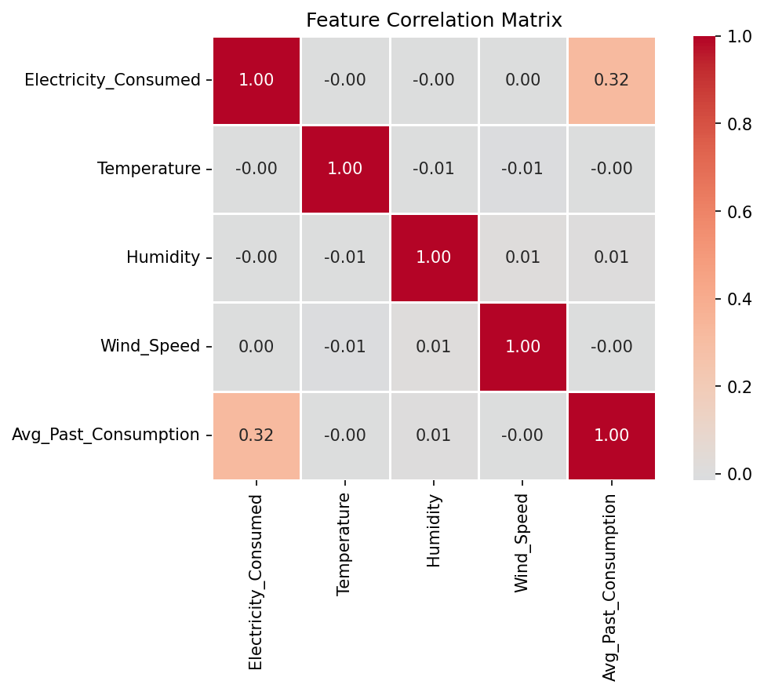

# Energy Anomaly Forecasting

Open-source machine learning project for **energy consumption anomaly detection** and **time-series forecasting**, built on the public [Kaggle Smart Meter Electricity Consumption Dataset](https://www.kaggle.com/datasets/ziya07/smart-meter-electricity-consumption-dataset).

## Mission

Develop reproducible pipelines to:

1. Ingest and validate 30-minute smart meter time-series data
2. Detect anomalous consumption patterns (Phase 2)
3. Forecast future energy demand (Phase 3)

All work uses publicly available data only. No proprietary systems or datasets are referenced.

## Current Status

| Phase | Scope | Status |
|-------|-------|--------|
| Phase 1 Week 1 | Environment setup, data ingestion, schema validation | **Complete** |
| Phase 1 Week 2 | Exploratory data analysis and load profiling | **Complete** |
| Phase 2 | Unsupervised anomaly detection (Isolation Forest, DBSCAN) | Planned |
| Phase 3 | Time-series forecasting (XGBoost, LSTM) | Planned |

### Phase 1 Week 2 highlights

- Peak mean consumption at **02:00** (hour 2); modest diurnal variation on normalized data
- **Weak weather correlation** with consumption (|r| &lt; 0.01 for temperature, humidity, wind)
- Strongest linear predictor: `Avg_Past_Consumption` (**r = +0.317**)
- Anomaly label baseline: **5% Abnormal** (250 / 5,000 rows; 19:1 imbalance)



Full analysis: [EDA Insights](eda-insights.md)

## Documentation

| Document | Purpose |
|----------|---------|
| [Getting Started](getting-started.md) | Install dependencies and run ingestion locally, on Colab, or on Kaggle |
| [Data Schema](data-schema.md) | Formal data dictionary for `smart_meter_data.csv` |
| [Verification Report](verification-report.md) | Evidence that Phase 1 Week 1 acceptance criteria are met |
| [Architecture](architecture.md) | Repository layout, data flow, and design decisions |
| [EDA Insights](eda-insights.md) | Phase 1 Week 2 exploratory analysis findings with figures |
| [Phase 2 Strategy](phase2-strategy.md) | Anomaly detection planning grounded in Phase 1 EDA |

## Quick Command

```bash
python -m src.data.ingest_data
```

Expected outcome: schema summary with shape `(5000, 7)`, zero nulls, and a continuity check **PASS**.

## License

This project is released under the [MIT License](../LICENSE).
