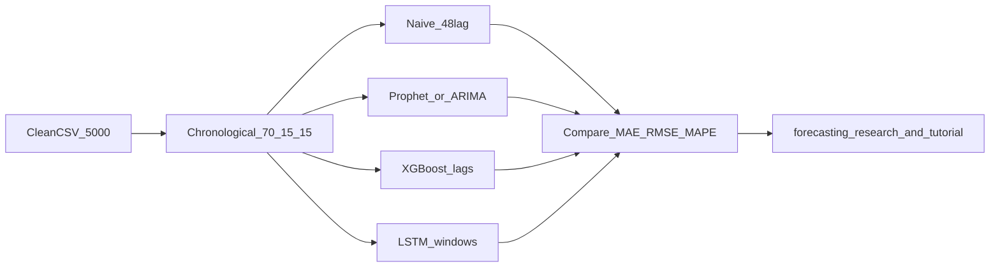

# Phase 3 Strategy — Time-Series Forecasting

Planning notes for the final technical phase: forecasting. Phase 1 (ingestion / EDA) and Phase 2 (anomaly detection and cleaning) are complete. We now have a clean, continuous dataset where historical anomalies have been masked and interpolated.

!!! success "Executive summary"

    - **Goal:** Predict future electricity use from the cleaned half-hour timeline — so demand forecasting sits on trustworthy history, not gaps or deleted rows.
    - **Starting point:** Default Phase 2 clean file (`clean_smart_meter_data.csv`) — continuous, ~248 repaired intervals, production recipe unchanged.
    - **Golden rule:** Split data **in time order** (70% train / 15% validation / 15% test). Never shuffle — that would leak the future into the past.
    - **Model ladder:** Beat a simple “same time yesterday” baseline before trusting Prophet/ARIMA, then XGBoost, then LSTM.
    - **Day 1–2 shipped:** Clean-state gate, chronological split, metrics module, and naive floor are implemented — see [Forecasting Baseline](forecasting-baseline.md).
    - **Terms:** [Glossary](glossary.md) — imputation, temporal split; forecasting metrics (MAE / RMSE / MAPE).

**Status:** Week 6 Day 1–2 foundation **complete**; statistical and ML forecasters planned next  
**Builds on:** [Clean Dataset](clean-data.md), [Anomaly Detection](anomaly-detection.md), [Feature Engineering](feature-engineering.md), [Architecture](architecture.md), [Forecasting Baseline](forecasting-baseline.md)

---

## What Phase 2 Handed Off

Phase 2 ends with a continuity-safe artifact ready for forecasting:

| Property | Value |
|----------|-------|
| Path | `data/processed/clean_smart_meter_data.csv` |
| Generator | `generate_clean_dataset()` / `scripts/generate_clean_data.py` (default **`legacy`** profile) |
| Shape | **5,000 × 15** (7 original + 8 engineered columns) |
| `Electricity_Consumed` NaNs | **0** after time interpolation |
| Rows dropped | **0** — timeline preserved |
| Anomalies imputed | ~**248** intervals (Isolation Forest at `contamination=0.05`) |

Research cleaning profiles (`legacy_threshold`, `enhanced`) remain opt-in and are **not** the Phase 3 baseline until leadership reviews artifact diffs. See [Clean Dataset — Research profiles](clean-data.md#research-profiles) and [Anomaly Tuning Results](anomaly-tuning-results.md).

---

## Step 0: Codebase & State Review Gate

**Implemented** via `scripts/verify_phase2_state.py` (loads the clean CSV only — does not retrain Isolation Forest). See [Forecasting Baseline — Step 0](forecasting-baseline.md#step-0--verify-phase-2-clean-state).

| Check | Pass criterion |
|-------|----------------|
| **Pipeline integrity** | Clean artifact present (regenerate with `generate_clean_data.py` if needed) |
| **Data continuity** | Clean dataset has exactly **5,000** rows |
| **No NaNs** | Interpolation left **0** nulls in `Electricity_Consumed` |
| **Modularity** | Phase 3 can load cleaned data **without** re-triggering Phase 2 anomaly training loops by default |

**Warm-up note:** Rolling / lag feature warm-up may drop the first incomplete rows *when building model feature matrices*. That is separate from the clean artifact, which must stay **5,000** continuous rows with filled consumption.

---

## Forecasting Objective

Predict future values of `Electricity_Consumed` from:

- **Historical consumption** (lags, recent windows)
- **Exogenous context** where useful — weather columns and time-of-day / calendar features from Phase 1–2

Success means a documented, reproducible forecast on a held-out **future** window, with errors reported in metrics management can interpret.

---

## 1. Data Splitting (The Golden Rule)

Unlike tabular ML, we **cannot** use random shuffling (e.g. a naïve `train_test_split`). That causes **data leakage**: the model sees the future while learning to predict the past.

| Rule | Choice |
|------|--------|
| Method | Strict **chronological** split |
| Train | **70%** — learn patterns |
| Validation | **15%** — hyperparameters / early stopping |
| Test | **15%** — final unseen holdout for reported business value |

All model comparisons must use the same cut points so results stay fair.

---

## 2. Evaluation Metrics

Forecasting uses different scores than Phase 2 anomaly F1:

| Metric | Plain meaning | Role |
|--------|---------------|------|
| **MAE** (Mean Absolute Error) | Average absolute miss | Easy to explain to management |
| **RMSE** (Root Mean Squared Error) | Penalizes large misses more | Stress-tests bad spikes |
| **MAPE** (Mean Absolute Percentage Error) | Relative error | Useful when scale matters; **caution** if values approach zero |

Primary reporting stack: MAE + RMSE; MAPE as a secondary relative view with the zero-denominator caveat noted.

---

## 3. Model Progression

Build complexity sequentially. If a complex model cannot beat a simpler one on the same test window, we do not adopt it as the headline result.

### A. Naive baseline — **implemented**

| | |
|--|--|
| **What** | Predict that consumption equals the value from **24 hours earlier** at the same clock time — a **48-step** lag at 30-minute resolution |
| **Why** | If advanced models cannot beat this rule of thumb, they are not earning their complexity |
| **Code** | `naive_seasonal_forecast` + `scripts/evaluate_naive_baseline.py` — [Forecasting Baseline](forecasting-baseline.md) |

### B. Statistical baseline (Prophet / Auto-ARIMA)

| | |
|--|--|
| **What** | Univariate time-series models that map trend and seasonality |
| **Why** | Strong mathematical floor; Prophet handles daily/weekly seasonality with less custom feature work |

### C. Advanced ML (XGBoost)

| | |
|--|--|
| **What** | Gradient-boosted trees on tabular features |
| **How** | XGBoost does not “read time” natively — feed **lag features** (e.g. \(t-1\), \(t-2\), \(t-48\)) plus temporal features (hour, day-of-week) from Phase 2 engineering |

### D. Deep learning (LSTM)

| | |
|--|--|
| **What** | Long Short-Term Memory network (recurrent architecture) |
| **How** | Format data as sliding windows into 3D tensors `[samples, time_steps, features]` — e.g. past **12 hours** (24 steps) to predict the next **30 minutes** |

---

## 4. Educational & Research Deliverables

Once models are evaluated, technical iteration pauses and grant-facing documentation takes priority:

| Deliverable | Purpose |
|-------------|---------|
| [`docs/forecasting-research.md`](forecasting-research.md) *(planned)* | Research write-up: how predictable the load profile is, which features mattered, model limits |
| [`notebooks/04_forecasting_tutorial.ipynb`](../notebooks/04_forecasting_tutorial.ipynb) *(planned)* | Student-facing tutorial: chronological split and model progression |
| README + `requirements.txt` polish | Final dependency list and Phase 3 quick-start |
| Handover slide deck | Summary for the close-out meeting |

---

## Open Implementation Notes

**Done (Week 6 Day 1–2):** Step 0 audit script, `time_series_split`, `evaluate_forecast`, naive seasonal baseline — see [Forecasting Baseline](forecasting-baseline.md).

Still deferred for later Phase 3 weeks:

- Choice of deep-learning stack (TensorFlow vs PyTorch) for LSTM
- Whether weather stays in the exogenous set after Ablation-style checks (Phase 2 already showed weak linear weather signal for *anomaly* detection; forecasting may differ)
- Prophet / Auto-ARIMA / XGBoost trainers

---

??? info "Technical deep dive"

    **Input API:** Load `data/processed/clean_smart_meter_data.csv`, or regenerate via `scripts/generate_clean_data.py` / `generate_clean_dataset(..., profile="legacy")`.

    **Split:** `time_series_split` — first 70% train, next 15% validation, final 15% test. Verify with `python -m src.data.make_forecast_dataset`.

    **Naive lag:** 48 steps = 24 h × 2 samples/hour — `naive_seasonal_forecast` in `train_forecast_models.py`.

    **Metrics:** `evaluate_forecast` in `evaluate_forecast.py` (MAE / RMSE / MAPE on test for headline numbers).

    **Dependencies (Day 1–2):** existing stack (pandas, scikit-learn). Later: `xgboost`, Prophet and/or `statsmodels` / `pmdarima`, plus a DL stack for LSTM.

    **Modularity:** Baseline path loads the clean CSV and does not call `detect_anomalies` unless you run `generate_clean_data.py` explicitly.

---

## References

- [Forecasting Baseline](forecasting-baseline.md) — Week 6 Day 1–2 implementation notes
- [Clean Dataset](clean-data.md) — Phase 2 imputation artifact for Phase 3
- [Anomaly Detection](anomaly-detection.md) — Isolation Forest production path used for cleaning
- [Feature Engineering](feature-engineering.md) — temporal and rolling features to reuse / extend for lags
- [Architecture](architecture.md) — repository layout and Phase roadmap
- [Phase 2 Strategy](phase2-strategy.md) — detection planning that led to the clean handoff
- [Glossary](glossary.md) — shared term definitions
