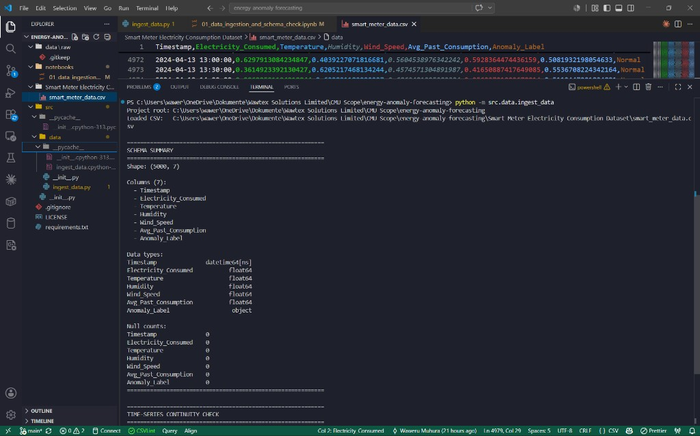
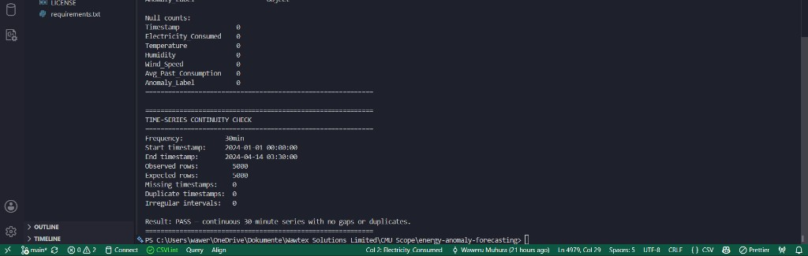

# Verification Report — Phase 1, Week 1

Evidence-based quality assurance for data ingestion and schema validation.

**Objective:** Load the 30-minute interval data and verify schema completeness.

**Test command:**

```bash
python -m src.data.ingest_data
```

**Run environment:** Local Windows development machine, Python 3.13, pandas 2.x.

---

## Schema Summary (Verified)



| Check | Expected | Observed | Result |
|-------|----------|----------|--------|
| Shape | `(5000, 7)` | `(5000, 7)` | PASS |
| Column count | 7 | 7 | PASS |
| `Timestamp` dtype | `datetime64[ns]` | `datetime64[ns]` | PASS |
| Numeric dtypes | `float64` | `float64` | PASS |
| `Anomaly_Label` dtype | `object` | `object` | PASS |
| Null values (all columns) | 0 | 0 | PASS |

### Verified column list

```
Timestamp
Electricity_Consumed
Temperature
Humidity
Wind_Speed
Avg_Past_Consumption
Anomaly_Label
```

---

## Time-Series Continuity Check (Verified)



| Check | Expected | Observed | Result |
|-------|----------|----------|--------|
| Frequency | 30 minutes | 30 minutes | PASS |
| Start timestamp | `2024-01-01 00:00:00` | `2024-01-01 00:00:00` | PASS |
| End timestamp | `2024-04-14 03:30:00` | `2024-04-14 03:30:00` | PASS |
| Observed rows | 5,000 | 5,000 | PASS |
| Expected rows | 5,000 | 5,000 | PASS |
| Missing timestamps | 0 | 0 | PASS |
| Duplicate timestamps | 0 | 0 | PASS |
| Irregular intervals | 0 | 0 | PASS |

**Overall continuity result:** PASS — continuous 30-minute series with no gaps or duplicates.

---

## Automated Check Matrix

These checks can be reproduced programmatically:

```python
from src.data.ingest_data import find_dataset_csv, load_smart_meter_data, get_project_root

EXPECTED_COLUMNS = [
    "Timestamp", "Electricity_Consumed", "Temperature", "Humidity",
    "Wind_Speed", "Avg_Past_Consumption", "Anomaly_Label",
]

root = get_project_root()
csv_path = find_dataset_csv(root)
df = load_smart_meter_data(csv_path)

assert csv_path.exists()
assert df.shape == (5000, 7)
assert list(df.columns) == EXPECTED_COLUMNS
assert str(df["Timestamp"].dtype).startswith("datetime64")
assert df.isna().sum().sum() == 0
assert (df["Timestamp"].diff().dropna() == __import__("pandas").Timedelta("30min")).all()
assert set(df["Anomaly_Label"].unique()) <= {"Normal", "Abnormal"}
```

| # | Check | Result |
|---|-------|--------|
| 1 | CSV found via dynamic discovery | PASS |
| 2 | Row count equals 5,000 | PASS |
| 3 | Column count equals 7 | PASS |
| 4 | Expected columns present in order | PASS |
| 5 | `Timestamp` parsed as datetime | PASS |
| 6 | Zero null values across all columns | PASS |
| 7 | All intervals are exactly 30 minutes | PASS |
| 8 | `Anomaly_Label` values are valid | PASS |

---

## Sign-Off Criteria

Phase 1, Week 1 is considered **complete** when all of the following hold:

1. `python -m src.data.ingest_data` exits with code 0
2. Schema summary reports shape `(5000, 7)` with zero nulls
3. Continuity check reports **PASS**
4. Notebook `notebooks/01_data_ingestion_and_schema_check.ipynb` runs the same logic on local, Colab, or Kaggle

**Status:** All criteria met. Ready to proceed to exploratory data analysis (Phase 1, Week 2+).

---

## Out of Scope for This Report

The following were intentionally excluded from Phase 1, Week 1:

- Statistical profiling (mean, std, distributions)
- Visualizations (histograms, time-series plots)
- Correlation analysis
- Model training or evaluation
